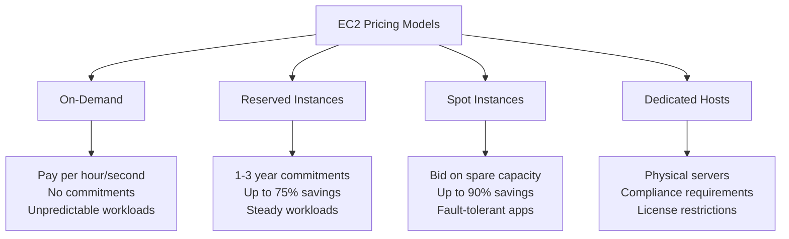
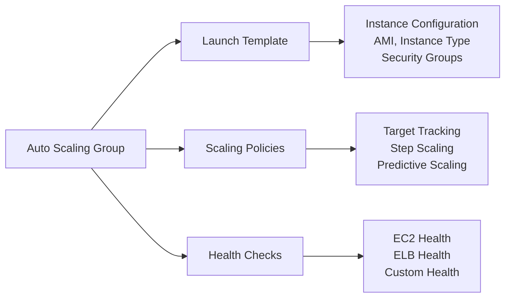
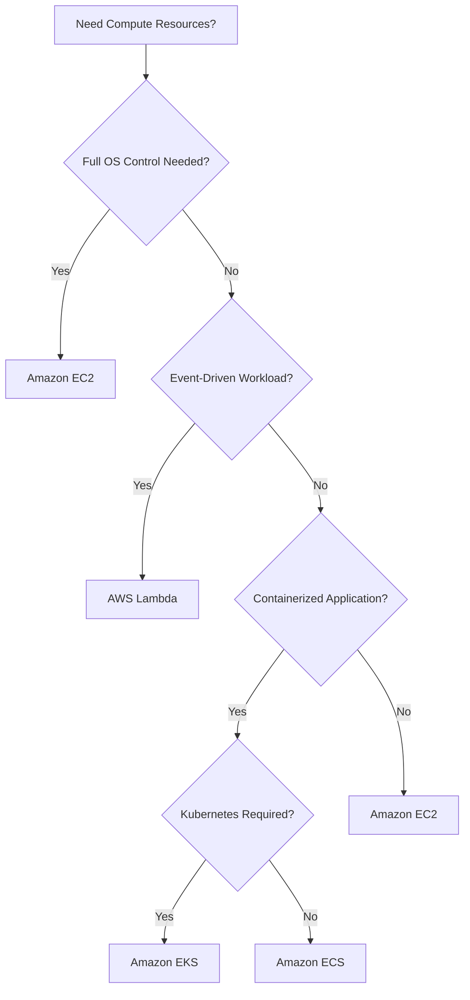
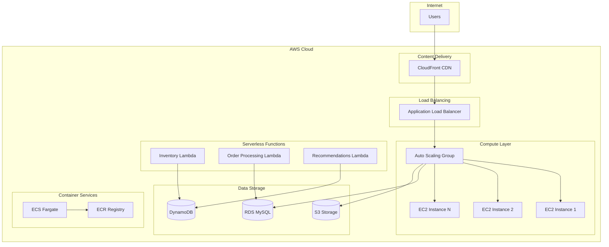
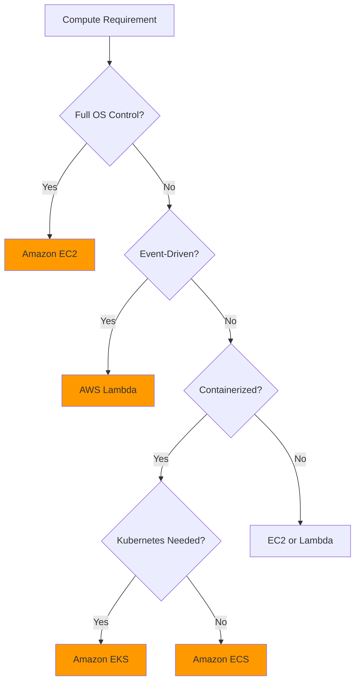

# AWS Certified Cloud Practitioner (CLF-C02) Study Guide

## 📘 Chapter 2: AWS Compute Services

[](https://aws.amazon.com/certification/certified-cloud-practitioner/)
[](LICENSE)
[](CONTRIBUTING.md)
---

## 📋 Table of Contents

- [Chapter Overview](#-chapter-overview)
- [Learning Objectives](#-learning-objectives)
- [Main Concepts & Explanations](#-main-concepts--explanations)
  - [Amazon EC2](#amazon-ec2-elastic-compute-cloud)
  - [AWS Lambda](#aws-lambda)
  - [Container Services (ECS & EKS)](#amazon-ecs--eks-container-services)
  - [Elastic Load Balancing](#elastic-load-balancing-elb)
  - [Auto Scaling](#auto-scaling)
  - [Service Selection Guide](#service-selection-when-to-choose-what)
- [Hands-on Labs](#-hands-on-labs)
  - [Lab 1: EC2 Instance Launch](#lab-31-launching-a-free-tier-ec2-instance)
  - [Lab 2: Lambda Function Deployment](#lab-32-deploying-a-simple-lambda-function)
  - [Lab 3: Auto Scaling & ELB Exploration](#lab-33-exploring-auto-scaling-and-elb-dashboards)
- [Real-World Scenario](#-real-world-scenario)
- [Practice Quiz](#-practice-quiz)
- [Summary & Key Takeaways](#-summary--key-takeaways)
- [Additional Resources](#-additional-resources)
- [Contributing](#-contributing)

---

## 🎯 Chapter Overview

AWS compute services form the backbone of cloud infrastructure, providing the processing power needed to run applications, websites, and workloads in the cloud. Understanding these services is crucial for the AWS Certified Cloud Practitioner exam, as they represent some of the most fundamental and widely-used AWS offerings.

In this chapter, you'll explore the core compute services that power modern cloud applications: from traditional virtual machines (Amazon EC2) to cutting-edge serverless computing (AWS Lambda), and container orchestration platforms (ECS/EKS). You'll also learn about supporting services like Elastic Load Balancing and Auto Scaling that make these compute resources highly available and scalable.

By the end of this chapter, you'll understand when to choose each compute service, how they work together to create resilient architectures, and gain hands-on experience deploying and managing these services in your own AWS environment.

---

## 🎓 Learning Objectives

By completing this chapter, you will be able to:

- [ ] Understand the purpose and use cases for each AWS compute service
- [ ] Compare pricing models and instance types for Amazon EC2
- [ ] Grasp serverless computing concepts with AWS Lambda
- [ ] Learn basic container orchestration with ECS and EKS
- [ ] Implement load balancing and auto scaling strategies
- [ ] Make informed decisions about which compute service to use for specific scenarios

---

## 📚 Main Concepts & Explanations

### Amazon EC2 (Elastic Compute Cloud)

> **Definition**: Amazon EC2 is AWS's foundational Infrastructure as a Service (IaaS) offering, providing resizable virtual machines in the cloud.

#### 🔧 Purpose and Core Features
- Provides virtual servers (instances) with full administrative control
- Offers complete flexibility over operating system, software, and configurations
- Scales from single instances to thousands of instances across multiple regions
- Integrates seamlessly with other AWS services for storage, networking, and security

#### 💻 Instance Types

| Family | Purpose | Use Cases | Examples |
|--------|---------|-----------|----------|
| **General Purpose** | Balanced CPU, memory, networking | Web servers, small databases, development | T3, T4g, M5, M6i |
| **Compute Optimized** | High-performance processors | Scientific computing, gaming | C5, C6i |
| **Memory Optimized** | High memory-to-CPU ratio | In-memory databases, real-time analytics | R5, R6i, X1 |
| **Storage Optimized** | High sequential read/write access | Big data, distributed file systems | I3, D3 |
| **Accelerated Computing** | GPU instances | Machine learning, HPC, graphics | P4, G4 |

#### 💰 Pricing Models



---

### AWS Lambda

> **Definition**: AWS Lambda is a serverless computing service that runs code in response to events without provisioning or managing servers.

#### ⚡ Serverless Computing Concepts

**Key Principles:**
- **No Server Management**: AWS handles infrastructure automatically
- **Event-Driven Execution**: Functions respond to triggers
- **Automatic Scaling**: Handles 1 to thousands of concurrent executions
- **Pay-per-Use**: Only pay for compute time consumed

#### 🔄 Event-Driven Architecture

```python
# Example: S3 file processing Lambda function
import json
import boto3

def lambda_handler(event, context):
    """
    Triggered when a file is uploaded to S3
    Processes the file and updates a database
    """
    s3_client = boto3.client('s3')
    
    # Get bucket and object key from event
    bucket = event['Records'][0]['s3']['bucket']['name']
    key = event['Records'][0]['s3']['object']['key']
    
    # Process the file
    try:
        # Your file processing logic here
        print(f"Processing file: {key} from bucket: {bucket}")
        
        return {
            'statusCode': 200,
            'body': json.dumps('File processed successfully')
        }
    except Exception as e:
        print(f"Error processing file: {str(e)}")
        raise
```

#### 📊 Common Triggers

| Trigger Source | Use Case | Example |
|----------------|----------|---------|
| **API Gateway** | Web APIs | REST API endpoints |
| **S3** | File processing | Image resizing, data validation |
| **DynamoDB** | Data changes | Audit logs, notifications |
| **CloudWatch** | Scheduled tasks | Daily reports, cleanup jobs |
| **SQS/SNS** | Message processing | Order processing, notifications |

---

### Amazon ECS & EKS (Container Services)

> **Containers**: Package applications with their dependencies for consistent deployment across environments.

#### 📦 Amazon ECS (Elastic Container Service)

**Features:**
- AWS-native container orchestration
- Deep AWS integration
- Supports EC2 and Fargate launch types
- Simplified container management

#### ☸️ Amazon EKS (Elastic Kubernetes Service)

**Features:**
- Fully managed Kubernetes
- Standard Kubernetes compatibility
- Multi-cloud and hybrid support
- Advanced orchestration capabilities

#### 🏗️ Container Architecture

```yaml
# Example ECS Task Definition
{
  "family": "web-app",
  "taskRoleArn": "arn:aws:iam::123456789012:role/ecsTaskRole",
  "containerDefinitions": [
    {
      "name": "web-server",
      "image": "nginx:latest",
      "memory": 512,
      "cpu": 256,
      "portMappings": [
        {
          "containerPort": 80,
          "protocol": "tcp"
        }
      ]
    }
  ]
}
```

---

### Elastic Load Balancing (ELB)

> **Purpose**: Distributes incoming traffic across multiple targets to ensure high availability and fault tolerance.

#### 🔄 Load Balancer Types

| Type | Layer | Best For | Key Features |
|------|-------|----------|--------------|
| **Application (ALB)** | Layer 7 | HTTP/HTTPS applications | Path-based routing, SSL termination |
| **Network (NLB)** | Layer 4 | High-performance TCP/UDP | Ultra-low latency, static IP |
| **Gateway (GWLB)** | Layer 3 | Third-party appliances | Transparent network gateway |

#### 🎯 Health Checks

```bash
# Example health check configuration
Health Check Protocol: HTTP
Health Check Path: /health
Health Check Port: 80
Healthy Threshold: 2
Unhealthy Threshold: 5
Timeout: 5 seconds
Interval: 30 seconds
```

---

### Auto Scaling

> **Purpose**: Automatically adjusts compute capacity based on demand to maintain performance while minimizing costs.

#### 📈 Auto Scaling Components



#### ⚙️ Scaling Strategies

| Strategy | When to Use | Configuration |
|----------|-------------|---------------|
| **Target Tracking** | Maintain specific metric | Keep CPU at 70% |
| **Step Scaling** | Precise control | Add 2 instances when CPU > 80% |
| **Predictive Scaling** | Predictable patterns | ML-based forecasting |
| **Scheduled Scaling** | Known demand patterns | Scale up before business hours |

---

### Service Selection: When to Choose What

#### 🤔 Decision Matrix



#### ✅ Selection Criteria

**Choose EC2 when:**
- ✅ Full control over operating system needed
- ✅ Legacy applications with specific requirements
- ✅ Consistent, long-running workloads
- ✅ Custom software installations required

**Choose Lambda when:**
- ✅ Event-driven applications
- ✅ Unpredictable or sporadic traffic
- ✅ Short-duration tasks (< 15 minutes)
- ✅ Minimal operational overhead desired

**Choose Containers when:**
- ✅ Microservices architecture
- ✅ Consistent deployment environments needed
- ✅ DevOps practices adoption
- ✅ Application modernization initiatives

---

## 🧪 Hands-on Labs

### Lab 3.1: Launching a Free Tier EC2 Instance

#### 📋 Prerequisites
- [ ] AWS Free Tier account
- [ ] AWS CLI installed (optional)
- [ ] Basic terminal/command line knowledge

#### 🖥️ Part A: Using AWS Console

**Step 1: Navigate to EC2 Dashboard**
1. Sign in to AWS Management Console
2. Search for "EC2" in services
3. Click "Launch Instance"


**Step 2: Configure Instance**
```yaml
Instance Configuration:
  Name: my-first-ec2-instance
  AMI: Amazon Linux 2023 (Free Tier Eligible)
  Instance Type: t2.micro (Free Tier Eligible)
  Key Pair: Create new - "my-ec2-keypair"
  Security Group: Create new - "web-server-sg"
    - SSH (22): Your IP
    - HTTP (80): 0.0.0.0/0
```

**Step 3: Launch and Connect**
```bash
# Download key pair and set permissions
chmod 400 my-ec2-keypair.pem

# Connect via SSH
ssh -i "my-ec2-keypair.pem" ec2-user@<PUBLIC_IP>
```

#### 💻 Part B: Using AWS CLI

```bash
# Create key pair
aws ec2 create-key-pair \
    --key-name my-cli-keypair \
    --query 'KeyMaterial' \
    --output text > my-cli-keypair.pem

chmod 400 my-cli-keypair.pem

# Create security group
aws ec2 create-security-group \
    --group-name cli-web-server-sg \
    --description "Security group for CLI instance"

# Add rules
aws ec2 authorize-security-group-ingress \
    --group-name cli-web-server-sg \
    --protocol tcp --port 22 --cidr $(curl -s http://checkip.amazonaws.com)/32

aws ec2 authorize-security-group-ingress \
    --group-name cli-web-server-sg \
    --protocol tcp --port 80 --cidr 0.0.0.0/0

# Launch instance
aws ec2 run-instances \
    --image-id ami-0c02fb55956c7d316 \
    --count 1 \
    --instance-type t2.micro \
    --key-name my-cli-keypair \
    --security-groups cli-web-server-sg
```

---

### Lab 3.2: Deploying a Simple Lambda Function

#### 📝 Step 1: Create Function via Console

1. Navigate to AWS Lambda Console
2. Click "Create function"
3. Choose "Author from scratch"

**Configuration:**
```yaml
Function Details:
  Name: hello-world-function
  Runtime: Python 3.11
  Architecture: x86_64
  Permissions: Create new role with basic Lambda permissions
```

#### 🐍 Step 2: Function Code

```python
import json
import datetime

def lambda_handler(event, context):
    """
    Simple Lambda function that processes events and returns a response
    """
    # Get current timestamp
    current_time = datetime.datetime.now().isoformat()
    
    # Extract information from event
    name = event.get('name', 'World')
    message_type = event.get('type', 'greeting')
    
    # Create response based on message type
    if message_type == 'greeting':
        message = f'Hello, {name}! Welcome to AWS Lambda.'
    elif message_type == 'farewell':
        message = f'Goodbye, {name}! Thanks for using AWS Lambda.'
    else:
        message = f'Hi {name}, you sent a {message_type} message.'
    
    # Return formatted response
    return {
        'statusCode': 200,
        'headers': {
            'Content-Type': 'application/json',
            'Access-Control-Allow-Origin': '*'
        },
        'body': json.dumps({
            'message': message,
            'timestamp': current_time,
            'event_received': event,
            'function_version': context.function_version,
            'request_id': context.aws_request_id
        }, indent=2)
    }
```

#### 🧪 Step 3: Test Events

**Test Event 1: Basic Greeting**
```json
{
  "name": "AWS Cloud Practitioner",
  "type": "greeting"
}
```

**Test Event 2: Farewell Message**
```json
{
  "name": "Student",
  "type": "farewell"
}
```

**Test Event 3: Custom Message**
```json
{
  "name": "Developer",
  "type": "notification",
  "data": {
    "project": "Lambda Learning",
    "status": "completed"
  }
}
```

#### 📊 Step 4: Monitor Execution

```bash
# View logs using AWS CLI
aws logs describe-log-groups --log-group-name-prefix /aws/lambda/hello-world-function

# Get recent log events
aws logs filter-log-events \
    --log-group-name /aws/lambda/hello-world-function \
    --start-time $(date -d '1 hour ago' +%s)000
```

---

### Lab 3.3: Exploring Auto Scaling and ELB Dashboards

#### 🔍 Part A: Auto Scaling Groups Analysis

**Step 1: Navigate to Auto Scaling Console**
1. EC2 Console → Auto Scaling → Auto Scaling Groups
2. Examine existing ASGs or create a new one

**Step 2: Key Metrics to Observe**
```yaml
Auto Scaling Group Configuration:
  Desired Capacity: 2
  Minimum Size: 1
  Maximum Size: 5
  
Health Checks:
  Type: EC2, ELB
  Grace Period: 300 seconds
  
Scaling Policies:
  - Target Tracking: CPU Utilization 70%
  - Step Scaling: Add 1 instance when CPU > 80%
  - Cooldown: 300 seconds
```

#### ⚖️ Part B: Load Balancer Dashboard

**Step 1: Load Balancer Types Comparison**

| Metric | Application LB | Network LB | Gateway LB |
|--------|----------------|------------|------------|
| **Latency** | ~100ms | <100μs | Varies |
| **Throughput** | Variable | 25 million RPS | Variable |
| **Target Types** | IP, Instance, Lambda | IP, Instance | IP, Instance |
| **Health Checks** | HTTP/HTTPS | TCP, HTTP | TCP |

**Step 2: Monitor Key Metrics**
```bash
# CloudWatch metrics to monitor
aws cloudwatch get-metric-statistics \
    --namespace AWS/ApplicationELB \
    --metric-name TargetResponseTime \
    --dimensions Name=LoadBalancer,Value=app/my-load-balancer/1234567890abcdef \
    --start-time 2023-01-01T00:00:00Z \
    --end-time 2023-01-01T23:59:59Z \
    --period 3600 \
    --statistics Average
```

#### 🧹 Lab Cleanup

```bash
# Terminate EC2 instances
aws ec2 terminate-instances --instance-ids i-1234567890abcdef0

# Delete Lambda function
aws lambda delete-function --function-name hello-world-function

# Delete security groups (after instances are terminated)
aws ec2 delete-security-group --group-name web-server-sg
aws ec2 delete-security-group --group-name cli-web-server-sg

# Delete key pairs
aws ec2 delete-key-pair --key-name my-ec2-keypair
aws ec2 delete-key-pair --key-name my-cli-keypair
```

---

## 🏢 Real-World Scenario

### TechShop Online: A Small Business AWS Journey

#### 📈 The Business Challenge

**Background**: TechShop Online is a growing electronics retailer that started with a simple website hosted on a single server in their office.

**Pain Points**:
- 🔥 Website crashes during flash sales and holiday spikes
- 💰 High costs maintaining physical servers
- 📊 Inability to scale for seasonal demand
- 🌍 Need for 24/7 availability for international markets
- ⚡ Growing demands for real-time features

#### 🏗️ The AWS Solution Architecture



#### 🚀 Implementation Phases

**Phase 1: Foundation with Amazon EC2**
```yaml
Production Environment:
  - EC2 Instances: 2x m5.large (Multi-AZ)
  - Database: RDS MySQL with automated backups
  - Storage: S3 + CloudFront for global content delivery
  - Cost Reduction: 40% compared to on-premises
```

**Phase 2: Auto Scaling Implementation**
```json
{
  "AutoScalingGroup": {
    "MinSize": 2,
    "MaxSize": 10,
    "DesiredCapacity": 2,
    "TargetGroupARNs": ["arn:aws:elasticloadbalancing:..."],
    "HealthCheckType": "ELB",
    "HealthCheckGracePeriod": 300
  },
  "ScalingPolicy": {
    "PolicyType": "TargetTrackingScaling",
    "TargetValue": 70.0,
    "ScaleOutCooldown": 300,
    "ScaleInCooldown": 300
  }
}
```

**Business Impact**: Successfully handled 500% traffic increase during Black Friday with zero downtime.

**Phase 3: Serverless Functions Implementation**

```python
# Inventory Update Lambda
def inventory_lambda_handler(event, context):
    """
    Processes inventory updates from S3 file uploads
    """
    import boto3
    import json
    
    s3 = boto3.client('s3')
    dynamodb = boto3.resource('dynamodb')
    table = dynamodb.Table('inventory')
    
    # Process S3 event
    bucket = event['Records'][0]['s3']['bucket']['name']
    key = event['Records'][0]['s3']['object']['key']
    
    # Download and process inventory file
    try:
        obj = s3.get_object(Bucket=bucket, Key=key)
        inventory_data = json.loads(obj['Body'].read())
        
        # Update DynamoDB
        with table.batch_writer() as batch:
            for item in inventory_data:
                batch.put_item(Item=item)
        
        return {
            'statusCode': 200,
            'body': json.dumps(f'Processed {len(inventory_data)} items')
        }
    except Exception as e:
        print(f'Error: {str(e)}')
        raise

# Order Processing Lambda
def order_lambda_handler(event, context):
    """
    Processes new orders through event-driven architecture
    """
    import boto3
    import json
    from datetime import datetime
    
    # Initialize AWS services
    ses = boto3.client('ses')
    rds = boto3.client('rds-data')
    
    order_data = json.loads(event['body'])
    
    try:
        # Process payment (integrate with payment service)
        payment_result = process_payment(order_data['payment'])
        
        # Update inventory
        update_inventory(order_data['items'])
        
        # Send confirmation email
        send_confirmation_email(order_data['customer_email'], order_data)
        
        # Trigger fulfillment workflow
        trigger_fulfillment(order_data)
        
        return {
            'statusCode': 200,
            'body': json.dumps({
                'order_id': order_data['id'],
                'status': 'processed',
                'timestamp': datetime.now().isoformat()
            })
        }
    except Exception as e:
        # Handle errors and send to DLQ
        print(f'Order processing failed: {str(e)}')
        return {
            'statusCode': 500,
            'body': json.dumps({'error': 'Order processing failed'})
        }
```

**Cost Benefits**: 60% reduction in processing costs due to pay-per-use model.

**Phase 4: Container Adoption with ECS**

```yaml
# ECS Task Definition for Product Catalog Service
version: '3'
services:
  product-catalog:
    image: techshop/product-catalog:latest
    ports:
      - "8080:8080"
    environment:
      - DATABASE_URL=${RDS_ENDPOINT}
      - REDIS_URL=${ELASTICACHE_ENDPOINT}
    cpu: 256
    memory: 512
    logging:
      driver: awslogs
      options:
        awslogs-group: /ecs/product-catalog
        awslogs-region: us-east-1
```

#### 📊 Results & Business Impact

**Performance Metrics**:
- ✅ **Uptime**: 99.9% (up from 95%)
- ✅ **Scalability**: Handles 10,000+ concurrent users
- ✅ **Global Performance**: < 100ms response time worldwide
- ✅ **Development Velocity**: 80% faster feature deployment

**Cost Optimization**:
- 💰 **Total IT Costs**: 45% reduction
- 💰 **Reserved Instances**: 30% savings on baseline capacity
- 💰 **Spot Instances**: 70% savings on batch processing
- 💰 **Serverless Functions**: Eliminated idle server costs

**Business Growth**:
- 📈 **Revenue Increase**: 250% during peak seasons
- 📈 **Customer Satisfaction**: 95% (up from 78%)
- 📈 **International Sales**: 40% of total revenue
- 📈 **Feature Releases**: Weekly deployments vs. monthly

#### 💡 Architecture Best Practices Learned

1. **Multi-AZ Deployment**: Critical for high availability
2. **Auto Scaling Policies**: Proactive scaling prevents performance issues
3. **Serverless First**: Use Lambda for event-driven, variable workloads
4. **Container Strategy**: Microservices enable independent scaling and deployment
5. **Monitoring & Alerting**: CloudWatch provides actionable insights
6. **Cost Optimization**: Mix of pricing models optimizes spend

---

## 📝 Practice Quiz

### Question 1
**Which AWS compute service is best suited for running a legacy enterprise application that requires a specific version of Windows Server with custom registry modifications?**

A) AWS Lambda  
B) Amazon ECS  
C) Amazon EC2  
D) AWS Fargate  

<details>
<summary>Click to reveal answer</summary>

**✅ Correct Answer: C) Amazon EC2**

**Explanation**: Amazon EC2 is the correct choice because it provides full virtual machines with complete administrative control over the operating system. Legacy applications often require specific OS configurations, custom software installations, registry modifications, and persistent storage—all of which are only available with EC2. Lambda is serverless and doesn't provide OS access, ECS is for containerized applications, and Fargate is a serverless container platform that doesn't offer the required OS-level control.

</details>

---

### Question 2
**A startup wants to build a web application backend that processes user uploads, resizes images, and stores them in S3. The processing happens infrequently and unpredictably. Which pricing model would be most cost-effective?**

A) EC2 On-Demand instances running 24/7  
B) EC2 Reserved Instances with 3-year commitment  
C) AWS Lambda with pay-per-invocation pricing  
D) EC2 Spot Instances with auto-scaling  

<details>
<summary>Click to reveal answer</summary>

**✅ Correct Answer: C) AWS Lambda with pay-per-invocation pricing**

**Explanation**: Lambda is ideal for this scenario because the workload is event-driven (triggered by file uploads), infrequent, and unpredictable. With Lambda, you only pay for actual compute time used during image processing, not for idle server time. The processing task (image resizing) is well-suited for Lambda's execution model and time limits. Running EC2 instances 24/7 for occasional processing would waste money on unused capacity, and Reserved Instances require predictable usage patterns to be cost-effective.

</details>

---

### Question 3
**What is the primary benefit of using an Application Load Balancer (ALB) with an Auto Scaling Group?**

A) It reduces the cost of EC2 instances  
B) It provides SSL encryption for data in transit  
C) It distributes traffic across healthy instances and automatically adjusts capacity  
D) It backs up EC2 instances automatically  

<details>
<summary>Click to reveal answer</summary>

**✅ Correct Answer: C) It distributes traffic across healthy instances and automatically adjusts capacity**

**Explanation**: The primary benefit of combining ALB with Auto Scaling Groups is high availability and scalability. The ALB performs health checks and only routes traffic to healthy instances, while the Auto Scaling Group automatically launches new instances when demand increases and terminates them when demand decreases. This combination ensures your application can handle varying traffic loads without manual intervention while maintaining availability even if individual instances fail. While ALB can handle SSL termination (option B), this isn't its primary benefit when used with Auto Scaling Groups.

</details>

---

### Question 4
**Which statement about AWS Lambda is FALSE?**

A) Lambda functions can run for a maximum of 15 minutes  
B) You pay only for the compute time your code consumes  
C) Lambda automatically scales to handle thousands of concurrent requests  
D) Lambda functions maintain persistent local storage between invocations  

<details>
<summary>Click to reveal answer</summary>

**✅ Correct Answer: D) Lambda functions maintain persistent local storage between invocations**

**Explanation**: This statement is false. Lambda functions are stateless and do not maintain persistent local storage between invocations. Each function execution starts with a clean environment, and any files written to the local file system are lost when the function completes. For persistent storage, Lambda functions must use external services like S3, DynamoDB, or EFS. All other statements are true: Lambda has a maximum execution time of 15 minutes, uses pay-per-use pricing, and automatically scales to handle concurrent requests.

</details>

---

### Question 5
**A company needs to run a containerized microservice that requires consistent performance and must be available 24/7. They want to minimize operational overhead. Which combination of services should they choose?**

A) Amazon ECS with EC2 launch type  
B) Amazon EKS with self-managed node groups  
C) Amazon ECS with Fargate launch type  
D) EC2 instances with Docker installed manually  

<details>
<summary>Click to reveal answer</summary>

**✅ Correct Answer: C) Amazon ECS with Fargate launch type**

**Explanation**: ECS with Fargate is the best choice for minimizing operational overhead while ensuring consistent performance. Fargate is a serverless container platform that eliminates the need to manage underlying EC2 instances—AWS handles patching, scaling, and infrastructure management automatically. ECS provides the orchestration needed for a 24/7 microservice with built-in health checks and service management. Option A (ECS with EC2) requires managing the underlying instances, option B (EKS) adds Kubernetes complexity, and option D (manual Docker) provides no orchestration or automated management capabilities.

</details>

---

### Question 6
**When would you choose EC2 Spot Instances over On-Demand instances?**

A) For critical production workloads that cannot tolerate interruption  
B) For batch processing jobs that can handle interruptions gracefully  
C) When you need guaranteed compute capacity for a specific time period  
D) For applications requiring consistent, predictable performance  

<details>
<summary>Click to reveal answer</summary>

**✅ Correct Answer: B) For batch processing jobs that can handle interruptions gracefully**

**Explanation**: Spot Instances are ideal for fault-tolerant, flexible workloads that can handle interruptions. Batch processing jobs typically fit this category because they can save their progress and resume later if interrupted. Spot Instances offer up to 90% savings compared to On-Demand pricing but can be terminated with just 2 minutes' notice when AWS needs the capacity back. They should not be used for critical production workloads (option A), applications requiring guaranteed capacity (option C), or those needing consistent performance (option D), as these requirements conflict with the interruptible nature of Spot Instances.

</details>

---

## 📋 Summary & Key Takeaways

### 🎯 Core AWS Compute Services Mastered

#### **Amazon EC2 - Virtual Machines in the Cloud**
- **What it is**: Resizable virtual servers with full OS control
- **Best for**: Legacy apps, custom configurations, persistent workloads
- **Pricing**: On-Demand, Reserved (up to 75% savings), Spot (up to 90% savings), Dedicated
- **Instance families**: General Purpose (T3, M5), Compute (C5), Memory (R5), Storage (I3), GPU (P4, G4)

#### **AWS Lambda - Serverless Computing**
- **What it is**: Run code without managing servers, pay only for execution time
- **Best for**: Event-driven apps, microservices, variable workloads, automation
- **Limits**: 15-minute max execution, stateless, automatic scaling
- **Triggers**: API Gateway, S3, DynamoDB, CloudWatch, SQS/SNS

#### **Container Services - Modern Application Deployment**
- **Amazon ECS**: AWS-native container orchestration, simplified management
- **Amazon EKS**: Managed Kubernetes for complex orchestration needs
- **AWS Fargate**: Serverless containers, zero infrastructure management
- **Best for**: Microservices, consistent deployment, DevOps practices

#### **Elastic Load Balancing - High Availability**
- **Application LB**: Layer 7, HTTP/HTTPS, advanced routing features
- **Network LB**: Layer 4, ultra-high performance, static IP addresses
- **Gateway LB**: Layer 3, third-party virtual appliances
- **Key features**: Health checks, SSL termination, cross-zone load balancing

#### **Auto Scaling - Dynamic Capacity Management**
- **Auto Scaling Groups**: Define min/max/desired capacity across AZs
- **Scaling policies**: Target tracking, step scaling, predictive scaling
- **Benefits**: Cost optimization, improved availability, automatic recovery

### 🔄 Service Selection Decision Framework



### 💡 Architecture Best Practices

#### **High Availability Design**
- ✅ Deploy across multiple Availability Zones
- ✅ Use Load Balancers for traffic distribution
- ✅ Implement health checks and auto-recovery
- ✅ Design for failure with redundancy

#### **Cost Optimization Strategies**
- 💰 **Baseline workloads**: Reserved Instances (1-3 years)
- 💰 **Variable workloads**: On-Demand or Spot Instances
- 💰 **Event-driven tasks**: Lambda pay-per-use
- 💰 **Scheduled workloads**: Scheduled scaling policies

#### **Security & Compliance**
- 🔒 Use IAM roles instead of access keys
- 🔒 Implement least privilege access principles
- 🔒 Enable VPC for network isolation
- 🔒 Regular security group audits

### 🎓 Hands-on Experience Gained

#### **Practical Skills Developed**
- [x] **EC2 Management**: Launch, configure, and connect to instances
- [x] **Serverless Development**: Create and deploy Lambda functions
- [x] **Infrastructure as Code**: Use AWS CLI for automation
- [x] **Monitoring & Logging**: Navigate CloudWatch dashboards
- [x] **Security Configuration**: Set up security groups and key pairs

#### **Real-world Application Understanding**
- [x] **Scalability Patterns**: How Auto Scaling responds to demand
- [x] **Load Distribution**: Traffic routing with ELB
- [x] **Cost Management**: Choosing appropriate pricing models
- [x] **Operational Excellence**: Monitoring and maintaining services

### 📊 Key Exam Topics for CLF-C02

#### **Must-Know Concepts**
1. **EC2 Instance Types**: When to use each family (General, Compute, Memory, Storage, GPU)
2. **Pricing Models**: Cost implications of On-Demand vs Reserved vs Spot
3. **Lambda Limitations**: 15-minute timeout, stateless execution, concurrent limits
4. **Container Orchestration**: Differences between ECS and EKS
5. **Load Balancer Types**: Application vs Network vs Gateway Load Balancer use cases
6. **Auto Scaling Triggers**: CPU utilization, custom metrics, scheduled scaling

#### **Common Exam Scenarios**
- **Scenario**: Legacy application migration → **Answer**: EC2 with appropriate instance type
- **Scenario**: Unpredictable, event-driven workload → **Answer**: Lambda
- **Scenario**: Microservices architecture → **Answer**: ECS/EKS with containers
- **Scenario**: High availability requirement → **Answer**: Multi-AZ with ELB and Auto Scaling
- **Scenario**: Cost optimization for steady workload → **Answer**: Reserved Instances

### 🚀 Next Steps & Continued Learning

#### **Immediate Actions**
- [ ] Practice launching different EC2 instance types
- [ ] Experiment with Lambda triggers from various AWS services
- [ ] Set up a complete web application with ELB and Auto Scaling
- [ ] Monitor costs and usage through AWS Billing Dashboard

#### **Advanced Topics to Explore**
- **Elastic Beanstalk**: Platform-as-a-Service for web applications
- **AWS Batch**: Large-scale batch computing
- **Amazon Lightsail**: Simplified cloud instances for small projects
- **AWS Outposts**: On-premises AWS infrastructure

#### **Certification Preparation**
- Review AWS Well-Architected Framework principles
- Practice with AWS CLF-C02 sample questions
- Understand shared responsibility model for compute services
- Study AWS pricing calculator for cost estimation scenarios

---

## 📚 Additional Resources

### 📖 Official AWS Documentation
- [Amazon EC2 User Guide](https://docs.aws.amazon.com/ec2/)
- [AWS Lambda Developer Guide](https://docs.aws.amazon.com/lambda/)
- [Amazon ECS Developer Guide](https://docs.aws.amazon.com/ecs/)
- [Amazon EKS User Guide](https://docs.aws.amazon.com/eks/)
- [Elastic Load Balancing User Guide](https://docs.aws.amazon.com/elasticloadbalancing/)

### 🎥 Training Videos & Courses
- [AWS Training and Certification](https://aws.amazon.com/training/)
- [AWS Cloud Practitioner Essentials](https://aws.amazon.com/training/course-descriptions/cloud-practitioner-essentials/)
- [AWS Well-Architected Framework](https://aws.amazon.com/architecture/well-architected/)

### 🛠️ Hands-on Practice
- [AWS Free Tier](https://aws.amazon.com/free/) - 12 months of free usage
- [AWS Workshops](https://workshops.aws/) - Self-paced labs and tutorials
- [AWS Samples GitHub](https://github.com/aws-samples) - Code examples and templates

### 📊 Tools & Calculators
- [AWS Pricing Calculator](https://calculator.aws/) - Estimate costs for AWS services
- [AWS TCO Calculator](https://aws.amazon.com/tco-calculator/) - Total Cost of Ownership comparison
- [AWS Architecture Center](https://aws.amazon.com/architecture/) - Reference architectures and best practices

### 📱 Mobile Apps
- **AWS Console Mobile App**: Manage AWS resources on the go
- **AWS Trusted Advisor**: Get personalized recommendations

### 🏆 Certification Resources
- [AWS Certified Cloud Practitioner Exam Guide](https://aws.amazon.com/certification/certified-cloud-practitioner/)
- [AWS Sample Questions](https://d1.awsstatic.com/training-and-certification/docs-cloud-practitioner/AWS-Certified-Cloud-Practitioner_Sample-Questions.pdf)
- [AWS Whitepapers](https://aws.amazon.com/whitepapers/) - In-depth technical content

---

## 🤝 Contributing

We welcome contributions to improve this study guide! Here's how you can help:

### 🐛 Report Issues
- Found an error? [Open an issue](../../issues/new?template=bug_report.md)
- Have a suggestion? [Submit a feature request](../../issues/new?template=feature_request.md)

### ✨ Contribute Content
1. **Fork** the repository
2. **Create** a new branch (`git checkout -b feature/improvement`)
3. **Make** your changes
4. **Test** all code examples and lab instructions
5. **Submit** a pull request with detailed description

### 📋 Contribution Guidelines
- Ensure all lab instructions are tested and Free Tier compatible
- Follow the established markdown formatting
- Include proper citations for AWS documentation
- Verify all CLI commands and code examples work correctly
- Update the Table of Contents if adding new sections

### 👥 Contributors
- [Your Name Here] - Initial creation
- [Contributor Name] - Feature additions
- [Community Member] - Bug fixes and improvements

---

## 📄 License

This project is licensed under the MIT License - see the [LICENSE](LICENSE) file for details.

### 📝 License Summary
- ✅ **Commercial use** - Use this content for commercial training
- ✅ **Modification** - Adapt content for your needs
- ✅ **Distribution** - Share with teams and students
- ✅ **Private use** - Use for personal learning
- ❗ **Include license** - Keep license notice in distributions

---

## 🙏 Acknowledgments

- **AWS Documentation Team** - For comprehensive service documentation
- **AWS Training Team** - For official certification guidance
- **Community Contributors** - For feedback and improvements
- **Beta Testers** - For validating lab instructions

---

## 📞 Support & Contact

### 💬 Questions & Discussion
- **GitHub Discussions**: Use the [Discussions tab](../../discussions) for questions
- **Issues**: Report bugs or request features via [Issues](../../issues)

### 📧 Direct Contact
- **Study Guide Maintainer**: [your-email@example.com](mailto:your-email@example.com)
- **Technical Questions**: Use GitHub Issues for technical questions

### 🔗 Follow for Updates
- **GitHub**: Star and watch this repository
- **AWS Updates**: Follow [@AWSTraining](https://twitter.com/AWSTraining)

---

<div align="center">

### 🎯 Ready for the Next Chapter?

**Continue your AWS journey with:**
- **Chapter 3**: AWS Storage Services (S3, EBS, EFS)
- **Chapter 4**: AWS Database Services (RDS, DynamoDB)
- **Chapter 5**: AWS Networking & Content Delivery

---

**⭐ If this guide helped you, please star the repository!**

[](https://github.com/username/aws-clf-c02-study-guide)
[](https://github.com/username/aws-clf-c02-study-guide/fork)

</div>
