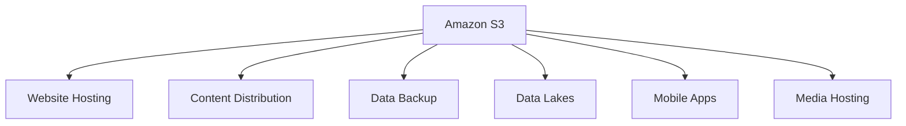
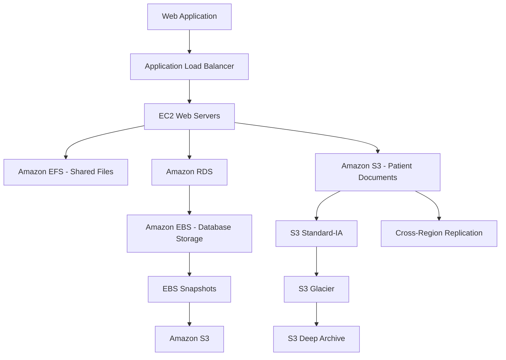
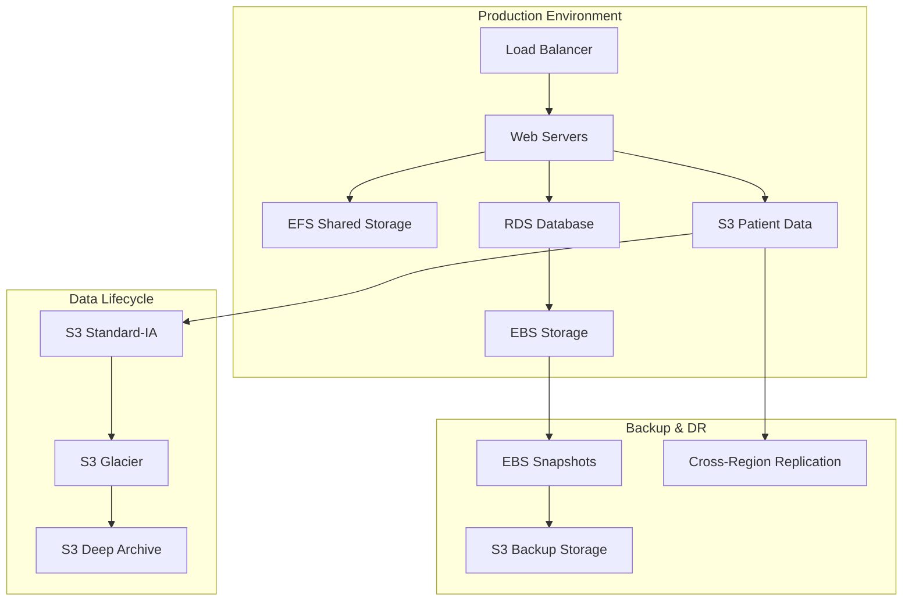
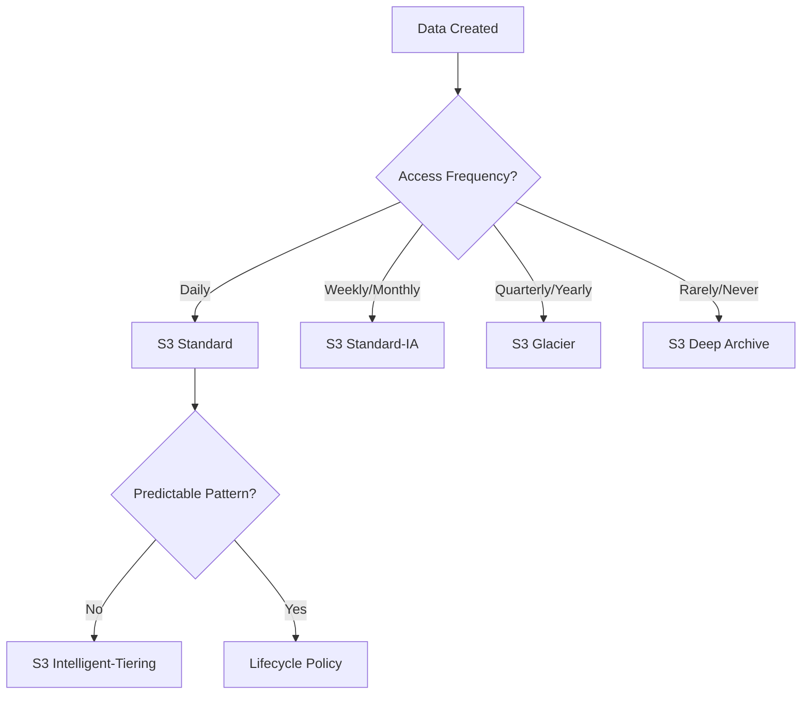
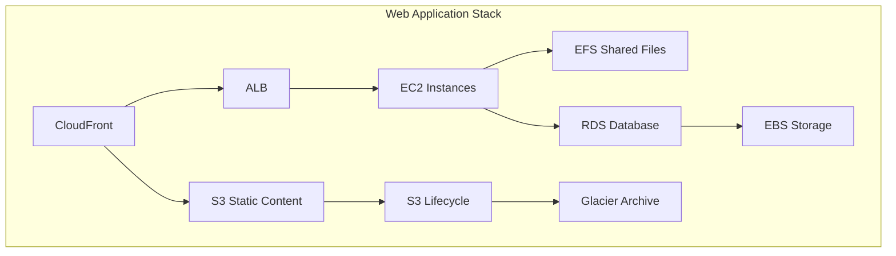

# 📘 Chapter 3: AWS Storage Services

> **AWS Certified Cloud Practitioner (CLF-C02) Study Guide**  
> Professional instructional eBook for IT professionals

---

## 📋 Table of Contents

- [1. Chapter Overview](#1-chapter-overview)
- [2. Main Concepts & Explanations](#2-main-concepts--explanations)
  - [Amazon S3 (Simple Storage Service)](#amazon-s3-simple-storage-service)
  - [Amazon EBS (Elastic Block Store)](#amazon-ebs-elastic-block-store)
  - [Amazon EFS (Elastic File System)](#amazon-efs-elastic-file-system)
  - [Amazon S3 Glacier](#amazon-s3-glacier)
  - [Data Access Patterns and Lifecycle Policies](#data-access-patterns-and-lifecycle-policies)
- [3. Hands-on Lab](#3-hands-on-lab)
  - [Lab 3.1: Creating and Managing an S3 Bucket](#lab-31-creating-and-managing-an-s3-bucket)
  - [Lab 3.2: Setting Up S3 Versioning and Lifecycle Rules](#lab-32-setting-up-s3-versioning-and-lifecycle-rules)
  - [Lab 3.3: Attaching an EBS Volume to EC2](#lab-33-attaching-an-ebs-volume-to-ec2)
  - [Lab 3.4: Creating and Mounting EFS File System](#lab-34-creating-and-mounting-efs-file-system)
- [4. Real-World Scenario](#4-real-world-scenario)
- [5. Quiz & Explanations](#5-quiz--explanations)
- [6. Summary & Key Takeaways](#6-summary--key-takeaways)

---

## 1. Chapter Overview

Cloud storage has revolutionized how organizations manage, access, and protect their data. Unlike traditional on-premises storage solutions that require significant upfront investments in hardware, maintenance, and physical space, AWS storage services provide scalable, secure, and cost-effective alternatives that grow with your business needs.

### 🎯 Learning Objectives

By the end of this chapter, you will be able to:

- ✅ Understand the four core AWS storage services and their use cases
- ✅ Choose the appropriate storage service based on requirements
- ✅ Implement S3 buckets with lifecycle policies and versioning
- ✅ Attach and manage EBS volumes for EC2 instances
- ✅ Configure shared EFS file systems for multi-instance access
- ✅ Design cost-effective storage architectures using multiple services

### 🌟 Why AWS Storage Matters

AWS storage services enable organizations to:

- **📈 Scale dynamically** without capacity planning concerns
- **💰 Pay only for what they use** with flexible pricing models
- **🛡️ Achieve high durability** with built-in redundancy and backup capabilities
- **🔒 Implement robust security** with encryption and access controls
- **⚡ Optimize costs** through intelligent storage class selection

You'll learn about four core AWS storage services: Amazon S3 for object storage, Amazon EBS for block storage, Amazon EFS for shared file systems, and Amazon S3 Glacier for long-term archival.

---

## 2. Main Concepts & Explanations

### Amazon S3 (Simple Storage Service)

Amazon S3 is AWS's flagship object storage service, designed to store and retrieve any amount of data from anywhere on the web. Think of S3 as a massive digital warehouse where you can store files of any type and size.

#### 🔑 Key Concepts

##### Buckets
S3 organizes data in containers called **buckets**. Each bucket has a globally unique name and serves as the top-level namespace for your objects.

- 📝 **Naming Requirements**: Must be DNS-compliant and unique across all AWS accounts worldwide
- 🌍 **Global Namespace**: Bucket names are globally unique but buckets are created in specific regions
- 📊 **No Limit**: You can create up to 100 buckets per AWS account (soft limit)

##### Objects
Files stored in S3 are called **objects**. Each object consists of:
- **Data**: The actual file content
- **Metadata**: System and user-defined metadata
- **Key**: Unique identifier (filename) within the bucket

**Size Limits:**
- Minimum: 0 bytes
- Maximum: 5 TB per object
- Multipart upload recommended for objects > 100 MB

#### 💾 Storage Classes

| Storage Class | Use Case | Retrieval Time | Durability | Cost |
|---------------|----------|----------------|------------|------|
| **S3 Standard** | Frequently accessed data | Milliseconds | 99.999999999% | Higher |
| **S3 Standard-IA** | Infrequent access, rapid retrieval | Milliseconds | 99.999999999% | Medium |
| **S3 One Zone-IA** | Infrequent access, single AZ | Milliseconds | 99.999999999% | Lower |
| **S3 Intelligent-Tiering** | Automatic optimization | Milliseconds | 99.999999999% | Variable |
| **S3 Glacier Instant** | Archive with instant access | Milliseconds | 99.999999999% | Low |
| **S3 Glacier Flexible** | Archive storage | Minutes to hours | 99.999999999% | Very Low |
| **S3 Glacier Deep Archive** | Long-term archive | 12+ hours | 99.999999999% | Lowest |

#### 🏗️ Common Use Cases



- 🌐 **Website hosting** and content distribution
- 💾 **Data backup** and archival
- 📊 **Data lakes** for analytics
- 📱 **Mobile and web application** storage
- 🎬 **Content distribution** and media hosting

---

### Amazon EBS (Elastic Block Store)

Amazon EBS provides persistent block storage volumes for use with EC2 instances. Unlike instance store volumes that are temporary, EBS volumes persist independently of EC2 instance lifecycles.

#### 📀 Volume Types

##### SSD-Backed Volumes

| Volume Type | Use Case | IOPS | Throughput | Size Range |
|-------------|----------|------|------------|------------|
| **gp3** | General purpose, latest generation | 3,000-16,000 | 125-1,000 MiB/s | 1 GiB - 16 TiB |
| **gp2** | General purpose, burstable | 100-16,000 | Up to 250 MiB/s | 1 GiB - 16 TiB |
| **io2** | High IOPS, mission critical | 100-64,000 | Up to 1,000 MiB/s | 4 GiB - 16 TiB |
| **io1** | High IOPS, previous generation | 100-64,000 | Up to 1,000 MiB/s | 4 GiB - 16 TiB |

##### HDD-Backed Volumes

| Volume Type | Use Case | Throughput | Size Range |
|-------------|----------|------------|------------|
| **st1** | Big data, data warehouses | Up to 500 MiB/s | 125 GiB - 16 TiB |
| **sc1** | Cold data, infrequent access | Up to 250 MiB/s | 125 GiB - 16 TiB |

#### 🔧 Key Features

- **📸 Snapshots**: Point-in-time backups stored in S3
- **🔐 Encryption**: Data encryption at rest and in transit
- **📏 Elastic Volumes**: Modify size, performance, and type without downtime
- **🔗 Multi-Attach**: Attach single volume to multiple instances (io1/io2 only)

#### 🎯 Use Cases with EC2

```bash
# Example: EBS volume lifecycle
EC2 Instance → EBS Volume (Boot) → Application Data → Snapshots → S3
```

- 🖥️ **Operating system** boot volumes
- 🗄️ **Database storage** for consistent performance
- 📁 **File systems** and application data
- 💽 **Persistent storage** that survives instance termination

---

### Amazon EFS (Elastic File System)

Amazon EFS provides scalable, shared file storage for use with EC2 instances and on-premises servers. Unlike EBS, EFS can be mounted by multiple instances simultaneously.

#### 🔄 Key Characteristics

##### Shared Access
- **Concurrent mounting** by multiple EC2 instances
- **Cross-AZ access** for high availability
- **NFS v4.1 protocol** for POSIX compliance
- **Automatic scaling** based on usage

##### Performance Modes

| Mode | Latency | Throughput | Operations/sec |
|------|---------|------------|----------------|
| **General Purpose** | Lowest | Up to 7,000 ops/sec | Standard workloads |
| **Max I/O** | Higher | Higher aggregate | >7,000 ops/sec |

##### Throughput Modes

| Mode | Description | Use Case |
|------|-------------|----------|
| **Bursting** | Scales with file system size | Variable workloads |
| **Provisioned** | Fixed throughput regardless of size | Consistent performance needs |

#### 🆚 EFS vs EBS Comparison

| Feature | EFS | EBS |
|---------|-----|-----|
| **Access** | Multiple instances | Single instance* |
| **Scaling** | Automatic | Manual |
| **Protocol** | NFS | Block-level |
| **Pricing** | Pay-per-use | Provisioned capacity |
| **Availability** | Multi-AZ | Single-AZ |

*Multi-Attach available for io1/io2 volumes with limitations

---

### Amazon S3 Glacier

S3 Glacier services are purpose-built for data archival and long-term backup, offering the lowest-cost storage options in AWS with longer retrieval times.

#### ❄️ Glacier Service Options

##### S3 Glacier Instant Retrieval
- **⚡ Retrieval Time**: Milliseconds
- **💰 Cost**: Higher than other Glacier options
- **🎯 Use Case**: Data accessed once or twice per year
- **📋 Examples**: Medical images, news media assets

##### S3 Glacier Flexible Retrieval
- **⚡ Retrieval Options**:
  - **Expedited**: 1-5 minutes (higher cost)
  - **Standard**: 3-5 hours (standard cost)
  - **Bulk**: 5-12 hours (lower cost)
- **🎯 Use Case**: Archive data with flexible retrieval needs

##### S3 Glacier Deep Archive
- **⚡ Retrieval Time**: 12 hours (standard), 48 hours (bulk)
- **💰 Cost**: Lowest available
- **🎯 Use Case**: Long-term compliance and digital preservation
- **📋 Examples**: Financial records, regulatory archives

#### 📊 Cost Comparison (Approximate)

```
S3 Standard         ████████████ $23/TB/month
S3 Standard-IA      ████████     $16/TB/month
S3 Glacier Instant  ████         $8/TB/month
S3 Glacier Flexible ██           $4/TB/month
S3 Deep Archive     █            $1/TB/month
```

---

### Data Access Patterns and Lifecycle Policies

Understanding data access patterns is crucial for optimizing storage costs and performance.

#### 🌡️ Access Patterns

| Pattern | Description | Recommended Storage |
|---------|-------------|-------------------|
| **🔥 Hot Data** | Frequently accessed, fast retrieval | S3 Standard |
| **🌤️ Warm Data** | Occasionally accessed, cost-sensitive | S3 Standard-IA |
| **❄️ Cool Data** | Rarely accessed, very cost-sensitive | S3 Glacier |
| **🧊 Cold Data** | Almost never accessed, compliance | S3 Deep Archive |

#### 🔄 Lifecycle Policies

Automate transitions between storage classes:

```json
{
    "Rules": [
        {
            "ID": "DataLifecycle",
            "Status": "Enabled",
            "Filter": {"Prefix": "logs/"},
            "Transitions": [
                {
                    "Days": 30,
                    "StorageClass": "STANDARD_IA"
                },
                {
                    "Days": 90,
                    "StorageClass": "GLACIER"
                },
                {
                    "Days": 365,
                    "StorageClass": "DEEP_ARCHIVE"
                }
            ]
        }
    ]
}
```

**Timeline Example:**
```
Day 0-30:    S3 Standard      (frequent access)
Day 31-90:   S3 Standard-IA   (occasional access)
Day 91-365:  S3 Glacier       (rare access)
Day 365+:    S3 Deep Archive  (compliance only)
```

---

## 3. Hands-on Lab

> **💡 Prerequisites**: AWS account with appropriate permissions, AWS CLI installed (optional)
> 
> **💰 Cost Note**: All exercises designed to stay within AWS Free Tier limits

### Lab 3.1: Creating and Managing an S3 Bucket

#### 🖥️ Console Method

**Step 1: Create S3 Bucket**

1. Navigate to the **S3 console**
2. Click **"Create bucket"**
3. Enter globally unique bucket name: `my-clf-practice-bucket-2025-[your-initials]`
4. Select your preferred **region**
5. Keep **default settings** for now
6. Click **"Create bucket"**

> 📸 `<<Screenshot Placeholder: S3 bucket creation interface showing bucket name field and region selection>>`

**Step 2: Upload Files**

1. Click on your newly created **bucket**
2. Click **"Upload"**
3. Select or **drag files** to upload (try different file types)
4. Review settings and click **"Upload"**

> 📸 `<<Screenshot Placeholder: S3 upload interface showing file selection and upload progress>>`

**Step 3: Explore Bucket Properties**

1. Navigate to **"Properties"** tab
2. Explore options: versioning, logging, notifications
3. Check **"Permissions"** tab for access controls

#### 💻 CLI Method

```bash
# Create a bucket (replace with your unique bucket name)
aws s3 mb s3://my-clf-practice-bucket-2025-jd

# Upload a file
aws s3 cp sample-file.txt s3://my-clf-practice-bucket-2025-jd/

# List bucket contents
aws s3 ls s3://my-clf-practice-bucket-2025-jd/

# Upload multiple files
aws s3 cp ./documents/ s3://my-clf-practice-bucket-2025-jd/docs/ --recursive

# Sync local directory to S3
aws s3 sync ./local-folder s3://my-clf-practice-bucket-2025-jd/folder/

# Check bucket size and object count
aws s3 ls s3://my-clf-practice-bucket-2025-jd --recursive --human-readable --summarize
```

---

### Lab 3.2: Setting Up S3 Versioning and Lifecycle Rules

#### 🔄 Enable Versioning

**Console Method:**

1. In your S3 bucket, go to **"Properties"**
2. Find **"Bucket Versioning"** section
3. Click **"Edit"**
4. Select **"Enable"**
5. Click **"Save changes"**

> 📸 `<<Screenshot Placeholder: S3 versioning configuration showing enable/disable options>>`

**Test Versioning:**
1. Upload a file: `test-file.txt`
2. Modify the file content locally
3. Upload the same file again
4. View **version history** in bucket

**CLI Method:**

```bash
# Enable versioning
aws s3api put-bucket-versioning \
    --bucket my-clf-practice-bucket-2025-jd \
    --versioning-configuration Status=Enabled

# Verify versioning is enabled
aws s3api get-bucket-versioning \
    --bucket my-clf-practice-bucket-2025-jd

# Upload same file multiple times to create versions
echo "Version 1 content" > test-file.txt
aws s3 cp test-file.txt s3://my-clf-practice-bucket-2025-jd/

echo "Version 2 content" > test-file.txt
aws s3 cp test-file.txt s3://my-clf-practice-bucket-2025-jd/

# List all versions
aws s3api list-object-versions \
    --bucket my-clf-practice-bucket-2025-jd
```

#### 🔄 Create Lifecycle Rules

**Console Method:**

1. Navigate to **"Management"** tab in your bucket
2. Click **"Create lifecycle rule"**
3. **Rule name**: `Standard-to-IA-transition`
4. **Rule scope**: Apply to all objects or specific prefix
5. **Configure transitions**:
   - Transition to Standard-IA after **30 days**
   - Transition to Glacier after **90 days** (optional)
6. Click **"Create rule"**

> 📸 `<<Screenshot Placeholder: Lifecycle rule configuration interface showing transition settings>>`

**CLI Method:**

```bash
# Create lifecycle configuration file
cat > lifecycle.json << 'EOF'
{
    "Rules": [
        {
            "ID": "StandardToIA",
            "Status": "Enabled",
            "Filter": {"Prefix": ""},
            "Transitions": [
                {
                    "Days": 30,
                    "StorageClass": "STANDARD_IA"
                },
                {
                    "Days": 90,
                    "StorageClass": "GLACIER"
                }
            ],
            "NoncurrentVersionTransitions": [
                {
                    "NoncurrentDays": 30,
                    "StorageClass": "STANDARD_IA"
                }
            ],
            "AbortIncompleteMultipartUpload": {
                "DaysAfterInitiation": 7
            }
        }
    ]
}
EOF

# Apply lifecycle configuration
aws s3api put-bucket-lifecycle-configuration \
    --bucket my-clf-practice-bucket-2025-jd \
    --lifecycle-configuration file://lifecycle.json

# Verify lifecycle configuration
aws s3api get-bucket-lifecycle-configuration \
    --bucket my-clf-practice-bucket-2025-jd
```

---

### Lab 3.3: Attaching an EBS Volume to EC2

> **Prerequisites**: Running EC2 instance (t2.micro for Free Tier), same AZ for volume and instance

#### 💾 Create and Attach EBS Volume

**Console Method:**

**Step 1: Create EBS Volume**

1. Navigate to **EC2 console**
2. Go to **"Volumes"** under "Elastic Block Store"
3. Click **"Create Volume"**
4. **Volume type**: General Purpose SSD (gp3)
5. **Size**: 8 GB (Free Tier eligible)
6. **Availability Zone**: Match your EC2 instance
7. Click **"Create Volume"**

> 📸 `<<Screenshot Placeholder: EBS volume creation showing volume type and size selection>>`

**Step 2: Attach Volume**

1. Select your new **volume**
2. Click **"Actions"** → **"Attach Volume"**
3. Select your target **EC2 instance**
4. **Device name**: `/dev/sdf` (Linux) or `xvdf`
5. Click **"Attach Volume"**

> 📸 `<<Screenshot Placeholder: Volume attachment dialog showing instance selection and device name>>`

**CLI Method:**

```bash
# Get your instance details
aws ec2 describe-instances \
    --query 'Reservations[*].Instances[*].[InstanceId,Placement.AvailabilityZone,State.Name]' \
    --output table

# Create EBS volume (replace AZ with your instance's AZ)
VOLUME_ID=$(aws ec2 create-volume \
    --size 8 \
    --volume-type gp3 \
    --availability-zone us-east-1a \
    --query 'VolumeId' \
    --output text)

echo "Created volume: $VOLUME_ID"

# Wait for volume to be available
aws ec2 wait volume-available --volume-ids $VOLUME_ID

# Attach volume (replace instance-id)
aws ec2 attach-volume \
    --volume-id $VOLUME_ID \
    --instance-id i-1234567890abcdef0 \
    --device /dev/sdf
```

#### 🔧 Format and Mount Volume (Linux)

**Connect to EC2 instance:**

```bash
# SSH to your EC2 instance
ssh -i your-key.pem ec2-user@your-instance-ip
```

**Format and mount the volume:**

```bash
# Check if volume is attached
lsblk
# Output should show xvdf (or nvme1n1 on newer instance types)

# Check if volume has file system
sudo file -s /dev/xvdf
# If output shows "data", the volume is empty and needs formatting

# Create XFS file system
sudo mkfs -t xfs /dev/xvdf

# Create mount point
sudo mkdir /data

# Mount the volume
sudo mount /dev/xvdf /data

# Verify mount
df -h
# Should show /dev/xvdf mounted on /data

# Test write permissions
sudo touch /data/test-file
ls -la /data/

# Make mount persistent across reboots
sudo cp /etc/fstab /etc/fstab.backup
echo '/dev/xvdf /data xfs defaults,nofail 0 2' | sudo tee -a /etc/fstab

# Test fstab entry
sudo umount /data
sudo mount -a
df -h  # Should show /data mounted again
```

**Create EBS snapshot:**

```bash
# From your local machine (not EC2)
# Create snapshot
SNAPSHOT_ID=$(aws ec2 create-snapshot \
    --volume-id $VOLUME_ID \
    --description "My first EBS snapshot" \
    --query 'SnapshotId' \
    --output text)

echo "Created snapshot: $SNAPSHOT_ID"

# Check snapshot progress
aws ec2 describe-snapshots \
    --snapshot-ids $SNAPSHOT_ID \
    --query 'Snapshots[0].Progress'
```

---

### Lab 3.4: Creating and Mounting EFS File System

#### 📁 Create EFS File System

**Console Method:**

1. Navigate to **EFS console**
2. Click **"Create file system"**
3. Choose **"Customize"** for more options
4. **File system name**: `my-efs-demo`
5. Keep **default VPC** and availability zones
6. **Performance mode**: General Purpose
7. **Throughput mode**: Bursting
8. Click **"Create"**

> 📸 `<<Screenshot Placeholder: EFS creation interface showing performance and throughput mode options>>`

**Configure Security Groups:**

1. After creation, click on your **file system**
2. Go to **"Network"** tab
3. Ensure security groups allow **NFS traffic (port 2049)** from EC2 instances

**CLI Method:**

```bash
# Create EFS file system
FILE_SYSTEM_ID=$(aws efs create-file-system \
    --creation-token my-efs-demo-$(date +%s) \
    --performance-mode generalPurpose \
    --throughput-mode bursting \
    --query 'FileSystemId' \
    --output text)

echo "Created EFS: $FILE_SYSTEM_ID"

# Get default VPC and subnets
VPC_ID=$(aws ec2 describe-vpcs \
    --filters "Name=is-default,Values=true" \
    --query 'Vpcs[0].VpcId' \
    --output text)

# Get subnets in default VPC
aws ec2 describe-subnets \
    --filters "Name=vpc-id,Values=$VPC_ID" \
    --query 'Subnets[*].[SubnetId,AvailabilityZone]' \
    --output table

# Create mount targets (replace subnet-id and security-group-id)
aws efs create-mount-target \
    --file-system-id $FILE_SYSTEM_ID \
    --subnet-id subnet-12345 \
    --security-groups sg-12345
```

#### 🔗 Mount EFS on EC2 Instances

**Install EFS utilities:**

```bash
# Connect to your EC2 instance
ssh -i your-key.pem ec2-user@your-instance-ip

# Install EFS utilities (Amazon Linux 2)
sudo yum install -y amazon-efs-utils

# Alternative for Ubuntu/Debian
# sudo apt-get update && sudo apt-get install -y nfs-common
```

**Mount EFS:**

```bash
# Create mount point
sudo mkdir /mnt/efs

# Mount using EFS helper (replace fs-xxxxxxxxx with your file system ID)
sudo mount -t efs fs-xxxxxxxxx:/ /mnt/efs

# Alternative mount using NFS (replace with your EFS DNS name)
sudo mount -t nfs4 -o nfsvers=4.1,rsize=1048576,wsize=1048576,hard,timeo=600,retrans=2 \
    fs-xxxxxxxxx.efs.us-east-1.amazonaws.com:/ /mnt/efs

# Verify mount
df -h | grep efs
mount | grep efs

# Test write access
echo "Hello from $(hostname)!" | sudo tee /mnt/efs/test-file.txt
cat /mnt/efs/test-file.txt

# Create additional test files
sudo mkdir /mnt/efs/shared-docs
echo "Shared document content" | sudo tee /mnt/efs/shared-docs/readme.txt
```

**Make mount persistent:**

```bash
# Add to fstab for persistent mounting
echo 'fs-xxxxxxxxx.efs.us-east-1.amazonaws.com:/ /mnt/efs efs defaults,_netdev' | sudo tee -a /etc/fstab

# Test fstab entry
sudo umount /mnt/efs
sudo mount -a
ls /mnt/efs/  # Should show your test files
```

#### 🔄 Test Shared Access

**Launch second EC2 instance:**

1. **Launch** another t2.micro instance in same VPC
2. **Install** EFS utilities on second instance
3. **Mount** the same EFS file system
4. **Verify** files created on first instance are visible

```bash
# On second EC2 instance
sudo yum install -y amazon-efs-utils
sudo mkdir /mnt/efs
sudo mount -t efs fs-xxxxxxxxx:/ /mnt/efs

# Check shared files
ls -la /mnt/efs/
cat /mnt/efs/test-file.txt

# Create file from second instance
echo "Hello from $(hostname) - second instance!" | sudo tee /mnt/efs/from-instance-2.txt

# Verify on first instance that file appears
```

**Performance testing:**

```bash
# Test write performance
time dd if=/dev/zero of=/mnt/efs/testfile bs=1M count=100

# Test read performance
time dd if=/mnt/efs/testfile of=/dev/null bs=1M

# Cleanup test file
sudo rm /mnt/efs/testfile
```

---

## 4. Real-World Scenario

### 🏥 Healthcare Data Management with AWS Storage Services

#### Company Profile

**MedTech Solutions** is a healthcare technology company providing electronic health records (EHR) systems to hospitals and clinics across the United States. They manage sensitive patient data while adhering to strict HIPAA compliance requirements.

#### 📊 Business Requirements

| Requirement | Challenge | Impact |
|-------------|-----------|---------|
| **🔒 Data Security** | Patient data requires encryption | HIPAA compliance mandatory |
| **📋 Compliance** | 7-10 year retention periods | Regulatory requirements |
| **📈 Scalability** | 500GB monthly growth | Storage needs increasing |
| **⚡ Performance** | <200ms database queries | User experience critical |
| **💰 Cost Management** | Optimize storage costs | Budget constraints |
| **🔄 Disaster Recovery** | Cross-region backup | Business continuity |

#### 🏗️ AWS Storage Architecture Solution



#### 📁 Storage Service Implementation

##### Amazon S3 for Application Data and Backups

**Primary Use**: Patient documents, medical images, application logs

**Configuration**:
```json
{
    "BucketPolicy": {
        "Version": "2012-10-17",
        "Statement": [
            {
                "Effect": "Deny",
                "Principal": "*",
                "Action": "s3:*",
                "Resource": ["arn:aws:s3:::medtech-patient-data/*"],
                "Condition": {
                    "Bool": {
                        "aws:SecureTransport": "false"
                    }
                }
            }
        ]
    },
    "Encryption": {
        "Rules": [
            {
                "ApplyServerSideEncryptionByDefault": {
                    "SSEAlgorithm": "aws:kms",
                    "KMSMasterKeyID": "arn:aws:kms:us-east-1:123456789012:key/12345678-1234-1234-1234-123456789012"
                }
            }
        ]
    }
}
```

**Features Implemented**:
- ✅ **Server-side encryption** with AWS KMS for HIPAA compliance
- ✅ **Cross-region replication** to secondary region for DR
- ✅ **Versioning enabled** to track document changes
- ✅ **Intelligent-Tiering** for medical images with changing access patterns

##### Amazon EBS for Database Storage

**Primary Use**: MySQL database for patient records

**Configuration**:
- **Volume Type**: gp3 (General Purpose SSD)
- **Size**: 2 TB (initially)
- **IOPS**: 10,000 provisioned
- **Throughput**: 500 MB/s
- **Encryption**: Enabled with KMS

**Backup Strategy**:
```bash
# Automated snapshot creation
aws ec2 create-snapshot \
    --volume-id vol-database-primary \
    --description "Daily DB backup $(date +%Y-%m-%d)" \
    --tag-specifications 'ResourceType=snapshot,Tags=[{Key=Purpose,Value=DatabaseBackup},{Key=RetentionDays,Value=30}]'
```

**Performance Benefits**:
- ⚡ **Response time**: Improved from 800ms to 150ms
- 📊 **Consistent IOPS**: 10,000 IOPS guaranteed
- 🔄 **No downtime scaling**: Volume size increased from 1TB to 2TB without interruption

##### Amazon EFS for Shared Application Files

**Primary Use**: Configuration files, templates, cached data

**Configuration**:
- **Performance Mode**: General Purpose
- **Throughput Mode**: Bursting
- **Storage Class**: Standard
- **Backup**: Enabled with 35-day retention

**Implementation Benefits**:
- 🔗 **Concurrent access** from multiple EC2 instances across AZs
- 📈 **Automatic scaling** eliminates capacity planning
- 📁 **POSIX-compliant** file system for existing applications
- 💾 **Backup enabled** for additional data protection

**Mount Configuration**:
```bash
# Persistent mount across all web servers
echo 'fs-0123456789abcdef0.efs.us-east-1.amazonaws.com:/ /var/www/shared efs defaults,_netdev' >> /etc/fstab
```

##### Amazon S3 Glacier for Long-term Compliance

**Primary Use**: Historical patient records and compliance archives

**Lifecycle Policy Implementation**:
```json
{
    "Rules": [
        {
            "ID": "PatientRecordsLifecycle",
            "Status": "Enabled",
            "Filter": {"Prefix": "patient-records/"},
            "Transitions": [
                {
                    "Days": 730,
                    "StorageClass": "STANDARD_IA"
                },
                {
                    "Days": 1825,
                    "StorageClass": "GLACIER"
                },
                {
                    "Days": 3650,
                    "StorageClass": "DEEP_ARCHIVE"
                }
            ]
        },
        {
            "ID": "MedicalImagingLifecycle",
            "Status": "Enabled",
            "Filter": {"Prefix": "medical-images/"},
            "Transitions": [
                {
                    "Days": 365,
                    "StorageClass": "STANDARD_IA"
                },
                {
                    "Days": 1095,
                    "StorageClass": "GLACIER"
                }
            ]
        }
    ]
}
```

**Data Retention Timeline**:
```
Active Records (0-2 years):     S3 Standard      → Immediate access
Semi-Active (2-5 years):       S3 Standard-IA   → Occasional access  
Archive (5-10 years):          S3 Glacier       → Compliance access
Deep Archive (10+ years):      S3 Deep Archive  → Legal retention
```

#### 📊 Implementation Results

##### Cost Optimization
- **💰 60% reduction** in storage costs vs on-premises
- **📉 Monthly savings**: $15,000 through intelligent tiering
- **⚡ Performance improvement**: 5x faster database queries

##### Operational Benefits
- **🤖 Automated lifecycle** management reduces manual overhead
- **🔄 Disaster recovery** RPO: 1 hour, RTO: 4 hours
- **📈 Scalability**: Handles 500GB monthly growth automatically
- **🛡️ Security**: Full HIPAA compliance with encryption and audit trails

##### Architecture Diagram


##### Monitoring and Compliance
```bash
# CloudWatch metrics for storage monitoring
aws cloudwatch get-metric-statistics \
    --namespace AWS/S3 \
    --metric-name BucketSizeBytes \
    --dimensions Name=BucketName,Value=medtech-patient-data Name=StorageType,Value=StandardStorage \
    --start-time 2025-06-01T00:00:00Z \
    --end-time 2025-07-01T00:00:00Z \
    --period 86400 \
    --statistics Average

# S3 access logging for compliance audits
aws s3api put-bucket-logging \
    --bucket medtech-patient-data \
    --bucket-logging-status file://logging-config.json
```

This architecture demonstrates how AWS storage services integrate to create a comprehensive, compliant, and cost-effective solution for healthcare data management.

---

## 5. Quiz & Explanations

### ❓ Question 1
Which AWS storage service would be most appropriate for a web application that needs to store user-uploaded photos that are frequently accessed during the first month but rarely accessed afterward?

**A)** Amazon EBS with General Purpose SSD volumes  
**B)** Amazon S3 with Intelligent-Tiering  
**C)** Amazon EFS with General Purpose performance mode  
**D)** Amazon S3 Glacier Deep Archive  

<details>
<summary><strong>✅ Answer & Explanation</strong></summary>

**Correct Answer: B) Amazon S3 with Intelligent-Tiering**

**Detailed Explanation:**

S3 Intelligent-Tiering is the optimal choice for this scenario because:

- **🔄 Automatic optimization**: Monitors access patterns and automatically moves objects between access tiers without performance impact
- **💰 Cost efficiency**: Frequently accessed photos stay in Standard tier (first month), then automatically move to IA tier when access decreases
- **⚡ No retrieval delays**: Maintains millisecond access times regardless of tier
- **🌐 Web accessibility**: Objects remain accessible via standard S3 APIs and CloudFront

**Why other options are incorrect:**
- **A) EBS**: Block storage for EC2 instances, not web-accessible object storage
- **C) EFS**: File system storage, not optimized for web application object storage
- **D) Glacier Deep Archive**: 12+ hour retrieval times make it unsuitable for web applications

**Real-world application**: Photo sharing platforms like Instagram use similar patterns where recent uploads get heavy traffic but older photos are accessed less frequently.
</details>

---

### ❓ Question 2
A company needs shared storage that can be accessed simultaneously by multiple EC2 instances running a distributed application. Which storage solution should they choose?

**A)** Amazon EBS Multi-Attach volumes  
**B)** Amazon S3 Standard storage class  
**C)** Amazon EFS (Elastic File System)  
**D)** Instance store volumes  

<details>
<summary><strong>✅ Answer & Explanation</strong></summary>

**Correct Answer: C) Amazon EFS (Elastic File System)**

**Detailed Explanation:**

EFS is specifically designed for this use case:

- **🔗 Concurrent access**: Multiple EC2 instances can mount the same file system simultaneously
- **🌐 Multi-AZ support**: Instances across different availability zones can access the same EFS
- **📁 POSIX compliance**: Standard file system semantics that applications expect
- **📈 Automatic scaling**: Storage capacity scales automatically based on usage

**Comparison with other options:**
- **A) EBS Multi-Attach**: Limited to io1/io2 volumes, requires cluster-aware applications, maximum 16 instances
- **B) S3 Standard**: Object storage, not a mountable file system for distributed applications
- **D) Instance store**: Temporary storage that doesn't persist and cannot be shared between instances

**Use case example**: A content management system where multiple web servers need to access shared templates, media files, and user uploads.

```bash
# EFS allows simple mounting across instances
sudo mount -t efs fs-12345678:/ /mnt/shared
```
</details>

---

### ❓ Question 3
Which S3 storage class offers the lowest cost for data that is accessed less than once per year and can tolerate retrieval times of 12+ hours?

**A)** S3 Standard-Infrequent Access (Standard-IA)  
**B)** S3 One Zone-Infrequent Access  
**C)** S3 Glacier Flexible Retrieval  
**D)** S3 Glacier Deep Archive  

<details>
<summary><strong>✅ Answer & Explanation</strong></summary>

**Correct Answer: D) S3 Glacier Deep Archive**

**Detailed Explanation:**

S3 Glacier Deep Archive is the optimal choice because:

- **💰 Lowest cost**: Most economical storage option in AWS (~$1/TB/month)
- **📅 Access pattern**: Designed for data accessed less than once per year
- **⏰ Retrieval time**: Standard retrieval in 12 hours, bulk retrieval in 48 hours
- **🏛️ Use cases**: Perfect for compliance archives, digital preservation, long-term backups

**Cost comparison (approximate per TB/month):**
```
S3 Standard-IA:        $16/TB/month
S3 One Zone-IA:        $12/TB/month  
S3 Glacier Flexible:   $4/TB/month
S3 Glacier Deep:       $1/TB/month  ← Lowest cost
```

**Why other options cost more:**
- **A & B**: Designed for infrequent but not archival access (monthly/quarterly)
- **C**: More expensive than Deep Archive, offers faster retrieval not needed here

**Example use case**: Financial institutions storing transaction records for regulatory compliance where data must be retained for 10+ years but rarely accessed.
</details>

---

### ❓ Question 4
An EC2 instance needs additional storage for a database that requires consistent performance and the ability to create point-in-time backups. Which storage option should be used?

**A)** Instance store volumes  
**B)** Amazon EFS file system  
**C)** Amazon EBS volumes  
**D)** Amazon S3 bucket mounted via S3FS  

<details>
<summary><strong>✅ Answer & Explanation</strong></summary>

**Correct Answer: C) Amazon EBS volumes**

**Detailed Explanation:**

EBS volumes are the correct choice for database storage because:

- **💾 Persistent storage**: Data survives EC2 instance stops/starts/terminations
- **⚡ Consistent performance**: Predictable IOPS and throughput for database workloads
- **📸 Snapshot capability**: Built-in point-in-time backup functionality
- **🔐 Encryption support**: Data encryption at rest and in transit
- **📏 Elastic scaling**: Can increase size, IOPS, and throughput without downtime

**Database-optimized EBS configuration:**
```bash
# Create high-performance volume for database
aws ec2 create-volume \
    --size 500 \
    --volume-type gp3 \
    --iops 3000 \
    --throughput 250 \
    --encrypted \
    --availability-zone us-east-1a
```

**Why other options are unsuitable:**
- **A) Instance store**: Temporary storage, data lost when instance stops
- **B) EFS**: Network file system with higher latency, not optimized for database I/O
- **D) S3FS**: High latency, not designed for database storage, consistency issues

**Performance benefits**: EBS gp3 volumes can provide up to 16,000 IOPS and 1,000 MB/s throughput for demanding database workloads.
</details>

---

### ❓ Question 5
A company wants to automatically transition old log files from S3 Standard to cheaper storage classes over time. What AWS feature should they use?

**A)** S3 Cross-Region Replication  
**B)** S3 Lifecycle policies  
**C)** S3 Transfer Acceleration  
**D)** S3 Event Notifications  

<details>
<summary><strong>✅ Answer & Explanation</strong></summary>

**Correct Answer: B) S3 Lifecycle policies**

**Detailed Explanation:**

S3 Lifecycle policies provide automated storage class transitions:

- **🔄 Automatic transitions**: Move objects between storage classes based on age
- **💰 Cost optimization**: Reduce storage costs without manual intervention
- **⚙️ Rule-based**: Configure transitions based on object age, prefixes, or tags
- **🗑️ Expiration**: Can also automatically delete objects after specified time

**Example lifecycle policy for log files:**
```json
{
    "Rules": [{
        "ID": "LogFileLifecycle",
        "Status": "Enabled",
        "Filter": {"Prefix": "logs/"},
        "Transitions": [
            {
                "Days": 30,
                "StorageClass": "STANDARD_IA"
            },
            {
                "Days": 90,
                "StorageClass": "GLACIER"
            },
            {
                "Days": 2555,
                "StorageClass": "DEEP_ARCHIVE"
            }
        ],
        "Expiration": {
            "Days": 3650
        }
    }]
}
```

**Why other options don't solve this need:**
- **A) Cross-Region Replication**: Copies objects to another region, doesn't change storage class
- **C) Transfer Acceleration**: Speeds up uploads, doesn't manage storage lifecycle
- **D) Event Notifications**: Triggers actions when events occur, doesn't automate transitions

**Cost savings example**: A company with 10TB of log data could save $200/month by implementing proper lifecycle policies.
</details>

---

### ❓ Question 6
Which statement about Amazon EBS snapshots is correct?

**A)** Snapshots are stored locally on the EC2 instance  
**B)** Snapshots are incremental and stored in Amazon S3  
**C)** Snapshots can only be taken when the EBS volume is detached  
**D)** Snapshots are automatically deleted when the EBS volume is deleted  

<details>
<summary><strong>✅ Answer & Explanation</strong></summary>

**Correct Answer: B) Snapshots are incremental and stored in Amazon S3**

**Detailed Explanation:**

EBS snapshots have these key characteristics:

- **📸 Incremental**: Only changed blocks are stored after the initial full snapshot
- **☁️ S3 storage**: Snapshots are stored in Amazon S3 (managed by AWS)
- **💰 Cost-effective**: Only pay for changed data after first snapshot
- **🌐 Cross-region**: Can copy snapshots between regions for disaster recovery

**How incremental snapshots work:**
```
Initial snapshot:     [████████████████] 100% of data
Second snapshot:      [██░░░░░░░░░░░░░░] Only changed blocks
Third snapshot:       [░░██░░░░░░░░░░░░] Only new changes
```

**Why other statements are incorrect:**
- **A)**: Snapshots are stored in S3, not locally on EC2 instances
- **C)**: Can take snapshots of attached volumes (though stopping I/O is recommended for consistency)
- **D)**: Snapshots persist independently; must be manually deleted

**Best practices:**
```bash
# Automate snapshot creation
aws ec2 create-snapshot \
    --volume-id vol-1234567890abcdef0 \
    --description "Daily backup $(date +%Y-%m-%d)"

# Copy snapshot to another region for DR
aws ec2 copy-snapshot \
    --source-region us-east-1 \
    --source-snapshot-id snap-1234567890abcdef0 \
    --destination-region us-west-2
```

**Real-world benefit**: A 1TB volume with daily snapshots where only 10GB changes daily will only cost for 10GB of additional storage per snapshot, not the full 1TB.
</details>

---

## 6. Summary & Key Takeaways

### 🎯 Core Storage Services Recap

| Service | Type | Primary Use Case | Key Benefit |
|---------|------|------------------|-------------|
| **Amazon S3** | Object Storage | Web apps, backup, content distribution | 99.999999999% durability, multiple storage classes |
| **Amazon EBS** | Block Storage | Database storage, file systems | High performance, persistent, snapshots |
| **Amazon EFS** | File Storage | Shared access across instances | Concurrent mounting, automatic scaling |
| **Amazon Glacier** | Archive Storage | Long-term retention, compliance | Lowest cost, multiple retrieval options |

### 🎲 Decision Framework

#### When to Choose S3
✅ **Perfect for:**
- Web application file storage and APIs
- Content distribution and static websites
- Data backup and archival solutions
- Analytics and big data storage
- Mobile application backends

❌ **Not suitable for:**
- Database storage requiring high IOPS
- Operating system boot volumes
- Applications requiring file system semantics

#### When to Choose EBS
✅ **Perfect for:**
- Database storage with consistent performance
- Operating system and application storage
- Single-instance file systems
- When you need point-in-time snapshots

❌ **Not suitable for:**
- Shared access across multiple instances
- Object storage for web applications
- Cost-sensitive archival storage

#### When to Choose EFS
✅ **Perfect for:**
- Applications requiring shared file access
- Content management systems
- Development environments with shared code
- Distributed applications needing shared configuration

❌ **Not suitable for:**
- High-performance database storage
- Single-instance applications
- Object storage for web APIs

#### When to Choose Glacier
✅ **Perfect for:**
- Long-term data archival and compliance
- Backup storage for infrequently accessed data
- Digital preservation and regulatory retention
- Cost optimization for old data

❌ **Not suitable for:**
- Frequently accessed data
- Applications requiring immediate access
- Real-time analytics workloads

### 💰 Cost Optimization Strategies

#### Storage Class Selection


#### Lifecycle Management Best Practices
1. **📊 Analyze access patterns** before setting up lifecycle rules
2. **🎯 Use prefixes** to apply different policies to different data types
3. **⏰ Set appropriate transition days** based on actual usage
4. **🗑️ Include expiration rules** for data with known end-of-life
5. **📈 Monitor costs** and adjust policies based on usage patterns

### 🔧 Hands-on Lab Achievements

Through this chapter's practical exercises, you have successfully:

- ✅ **Created S3 buckets** with proper naming and configuration
- ✅ **Implemented versioning** to track object changes over time
- ✅ **Set up lifecycle policies** for automated cost optimization
- ✅ **Attached EBS volumes** to EC2 instances and formatted them for use
- ✅ **Created EFS file systems** and mounted them across multiple instances
- ✅ **Used both Console and CLI** methods for all operations
- ✅ **Applied security best practices** with encryption and access controls

### 🏗️ Integration Patterns

#### Common Architecture Patterns


#### Service Combinations
- **S3 + CloudFront**: Global content delivery with edge caching
- **EBS + EC2**: High-performance computing with persistent storage
- **EFS + Auto Scaling**: Shared storage that scales with application demand
- **S3 + Glacier**: Complete data lifecycle from active to archive
- **Multiple Services**: Hybrid architectures addressing complex requirements

### 📚 Key Concepts for CLF-C02 Exam

#### Storage Durability and Availability
- **S3 durability**: 99.999999999% (11 9's) across all storage classes
- **EBS availability**: 99.999% within a single Availability Zone
- **EFS availability**: 99.9% across multiple Availability Zones

#### Performance Characteristics
- **S3**: Virtually unlimited scalability, request rate scales automatically
- **EBS**: Up to 64,000 IOPS and 1,000 MB/s throughput (io2 volumes)
- **EFS**: Up to 7,000 operations/sec (General Purpose mode)

#### Security Features
- **Encryption at rest**: Available for all storage services
- **Encryption in transit**: SSL/TLS for data transfer
- **Access controls**: IAM policies, bucket policies, ACLs
- **Compliance**: HIPAA, SOC, PCI DSS eligible services

### 🚀 Next Steps

With a solid understanding of AWS storage services, you're prepared to:

1. **🎯 Take practice exams** focusing on storage scenarios
2. **🔨 Build projects** combining multiple storage services
3. **📖 Study networking** and compute services in upcoming chapters
4. **💼 Apply knowledge** to real-world architecture decisions
5. **🎓 Schedule your CLF-C02 exam** with confidence

### 📋 Quick Reference Card

| Scenario | Recommended Service | Storage Class/Type |
|----------|-------------------|-------------------|
| Website static files | S3 | Standard or Intelligent-Tiering |
| Database storage | EBS | gp3 or io2 (based on performance needs) |
| Shared application files | EFS | Standard with General Purpose mode |
| 10-year compliance archive | S3 | Glacier Deep Archive |
| Frequently changing access patterns | S3 | Intelligent-Tiering |
| High-performance database | EBS | io2 with Provisioned IOPS |
| Cross-instance configuration | EFS | General Purpose or Max I/O |
| Backup and disaster recovery | S3 + EBS Snapshots | Standard-IA or Glacier |

This comprehensive understanding of AWS storage services positions you well for both the CLF-C02 certification exam and real-world cloud architecture decisions. The combination of theoretical knowledge, hands-on experience, and practical scenarios provides a solid foundation for your AWS journey.

---

> **📖 Continue Learning**: Proceed to Chapter 4: AWS Database Services to expand your cloud knowledge further.
> 
> **🎯 Exam Tip**: Focus on understanding the decision factors between storage services rather than memorizing exact pricing details.
> 
> **💡 Pro Tip**: Practice the hands-on labs multiple times to build muscle memory for the AWS console and CLI operations.