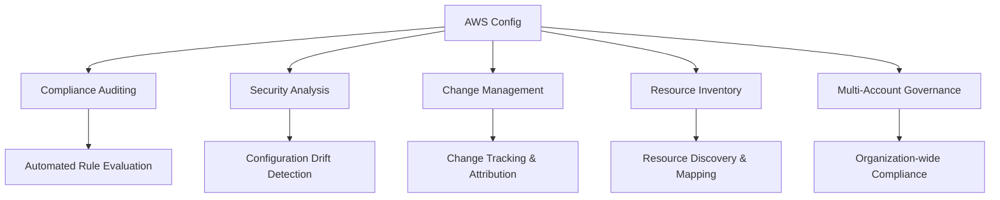

# Chapter 7: AWS Monitoring, Management, and Support

> **AWS Certified Cloud Practitioner (CLF-C02) Study Guide**  
> **Author:** [Your Name]  
> **Chapter:** 7 of 12  
> **Last Updated:** July 26, 2025

---

## 📋 Table of Contents

- [1. Chapter Overview](#1-chapter-overview)
- [2. Main Concepts & Explanations](#2-main-concepts--explanations)
  - [Amazon CloudWatch](#amazon-cloudwatch)
  - [AWS CloudTrail](#aws-cloudtrail)
  - [AWS Config](#aws-config)
  - [AWS Trusted Advisor](#aws-trusted-advisor)
  - [AWS Systems Manager](#aws-systems-manager)
  - [AWS Support Plans](#aws-support-plans)
- [3. Hands-on Labs](#3-hands-on-labs)
  - [Lab 7.1: Creating CloudWatch Alarms](#lab-71-creating-a-cloudwatch-alarm-for-ec2-instance-cpu-usage)
  - [Lab 7.2: Reviewing CloudTrail Logs](#lab-72-reviewing-cloudtrail-logs)
  - [Lab 7.3: Using Trusted Advisor](#lab-73-using-trusted-advisor-free-tier-view)
  - [Lab 7.4: Creating CloudWatch Dashboard](#lab-74-creating-a-basic-cloudwatch-dashboard)
- [4. Real-World Scenario](#4-real-world-scenario)
- [5. Quiz & Explanations](#5-quiz--explanations)
- [6. Summary & Key Takeaways](#6-summary--key-takeaways)
- [Additional Resources](#additional-resources)

---

## 1. Chapter Overview

Effective cloud operations require comprehensive visibility into your infrastructure, applications, and costs. AWS provides a robust suite of monitoring, management, and support tools that enable organizations to maintain optimal performance, ensure compliance, and receive assistance when needed.

This chapter introduces you to AWS's core monitoring and management services, including Amazon CloudWatch for metrics and alarms, AWS CloudTrail for audit logging, AWS Config for compliance tracking, and AWS Trusted Advisor for optimization recommendations. You'll also learn about AWS Systems Manager for operational management and the various AWS Support plans available to meet different organizational needs.

By the end of this chapter, you'll understand how to implement monitoring strategies, track resource changes, optimize costs and performance, and leverage AWS support resources effectively.

### 🎯 Learning Objectives

- Configure CloudWatch metrics, alarms, and dashboards
- Understand CloudTrail's role in security and compliance
- Use AWS Config for resource compliance monitoring
- Leverage Trusted Advisor for optimization recommendations
- Navigate AWS Support plan options and benefits

### 💡 Exam Relevance

This chapter covers approximately **15-20%** of the CLF-C02 exam content, particularly focusing on:
- **Domain 3:** Technology (Monitoring and Analytics services)
- **Domain 4:** Billing and Pricing (Support plans and cost optimization)

---

## 2. Main Concepts & Explanations

### Amazon CloudWatch

Amazon CloudWatch is AWS's comprehensive monitoring and observability service that provides real-time insights into your AWS resources and applications.

#### Core Components

##### 📊 Metrics
- **Definition:** Numerical data points collected over time from AWS resources
- **Default Metrics:** CPU utilization, disk I/O, network traffic
- **Custom Metrics:** Published from applications or scripts using CloudWatch API
- **Retention:** Stored for up to 15 months with varying resolutions
- **Examples:**
  - EC2 CPU utilization
  - RDS database connections
  - Lambda function duration
  - ELB request count

##### 🚨 Alarms
- **Purpose:** Automated actions triggered when metrics breach defined thresholds
- **Actions:**
  - Send notifications via Amazon SNS
  - Trigger Auto Scaling actions
  - Execute EC2 actions (stop, terminate, reboot)
  - Execute Systems Manager actions
- **States:**
  - `OK` - Metric is within threshold
  - `ALARM` - Metric has breached threshold
  - `INSUFFICIENT_DATA` - Not enough data to determine state
- **Configuration Options:**
  - Statistical functions (Average, Sum, Maximum, Minimum)
  - Evaluation periods and datapoints to alarm
  - Composite alarms combining multiple metrics

##### 📈 Dashboards
- **Features:**
  - Customizable visual displays of metrics and alarms
  - Real-time and historical data visualization
  - Shareable across teams and stakeholders
  - Cross-region metric display capabilities
- **Widget Types:**
  - Line graphs and stacked area charts
  - Number displays and gauges
  - Text widgets for annotations
  - Log widgets for CloudWatch Logs

##### 📝 CloudWatch Logs
- **Capabilities:**
  - Centralized log management service
  - Real-time log streaming and analysis
  - Log retention policies (1 day to indefinite)
  - Log insights for querying and analyzing log data
- **Sources:**
  - EC2 instances (via CloudWatch agent)
  - Lambda functions
  - API Gateway
  - VPC Flow Logs

### AWS CloudTrail

AWS CloudTrail provides governance, compliance, and operational auditing of your AWS account by recording API calls and related events.

#### Key Features

- **API Call Recording:** Captures all API calls made in your AWS account
- **Event Details:**
  - User identity and session information
  - Time of call and source IP address
  - Request parameters and response elements
  - User agent and error codes
- **Storage:** Delivers log files to Amazon S3 buckets
- **Integration:** Works with CloudWatch Logs for real-time monitoring
- **Multi-Region:** Can aggregate logs from multiple regions

#### Use Cases

| Use Case | Description | Benefit |
|----------|-------------|---------|
| **Security Analysis** | Track user activities and detect anomalies | Enhanced security posture |
| **Compliance Auditing** | Meet regulatory requirements | Simplified compliance reporting |
| **Resource Change Tracking** | Monitor who changed what and when | Better change management |
| **Troubleshooting** | Analyze API call patterns during incidents | Faster problem resolution |
| **Forensic Analysis** | Investigate security incidents | Detailed audit trail |

#### Event Types

##### Management Events
- **Description:** Control plane operations
- **Examples:**
  - Creating EC2 instances
  - Modifying security groups
  - Creating IAM users
  - Configuring VPCs
- **Default:** Logged automatically for all trails

##### Data Events
- **Description:** Resource-level operations
- **Examples:**
  - S3 object access (GetObject, PutObject)
  - Lambda function executions
  - DynamoDB item operations
- **Note:** Must be specifically enabled and may incur additional costs

##### Insight Events
- **Description:** Unusual activity patterns automatically detected
- **Detection:** Machine learning algorithms identify anomalies
- **Examples:**
  - Unusual API call volumes
  - Rare user activity patterns
  - Suspicious resource access patterns

### AWS Config

AWS Config continuously monitors and records your AWS resource configurations, enabling compliance auditing and change management.

#### Core Functionality

- **Configuration Snapshots:** Point-in-time views of resource configurations
- **Configuration History:** Timeline of configuration changes over time
- **Relationship Mapping:** Shows how resources relate to each other
- **Compliance Monitoring:** Evaluates resources against desired configurations
- **Change Notifications:** Alerts when configurations drift from baseline

#### Benefits



#### Configuration Rules

##### AWS Managed Rules
- **Pre-built Rules:** Common compliance requirements
- **Examples:**
  - `s3-bucket-public-access-prohibited`
  - `ec2-security-group-attached-to-eni`
  - `iam-password-policy`
  - `encrypted-volumes`

##### Custom Rules
- **Implementation:** AWS Lambda functions
- **Triggers:**
  - Configuration changes
  - Periodic assessments
  - On-demand evaluations
- **Use Cases:** Organization-specific compliance requirements

##### Remediation Actions
- **Automatic Remediation:** Fix non-compliant resources automatically
- **Implementation:** Systems Manager Automation documents
- **Examples:**
  - Remove public access from S3 buckets
  - Add required tags to resources
  - Enable encryption on EBS volumes

### AWS Trusted Advisor

AWS Trusted Advisor provides real-time guidance to help optimize your AWS infrastructure following best practices across five categories.

#### Five Pillars of Optimization

##### 💰 Cost Optimization
- **Underutilized Resources:**
  - EC2 instances with low CPU utilization
  - Idle load balancers
  - Unattached EBS volumes
- **Purchasing Recommendations:**
  - Reserved Instance opportunities
  - Savings Plans recommendations
- **Storage Optimization:**
  - EBS volume types optimization
  - S3 storage class recommendations

##### ⚡ Performance
- **Resource Analysis:**
  - EC2 instance types optimization
  - EBS volume performance
  - CloudFront distribution optimization
- **Bottleneck Identification:**
  - High utilization alerts
  - Capacity planning recommendations
- **Service Limits:** Proactive monitoring of service quotas

##### 🔒 Security
- **Access Control:**
  - Security group rule analysis
  - IAM access key rotation
  - MFA usage on root accounts
- **Resource Exposure:**
  - Publicly accessible RDS instances
  - S3 bucket permissions
  - EBS snapshots permissions
- **Certificate Management:** SSL certificate expiration alerts

##### 🛡️ Fault Tolerance
- **Backup Configurations:**
  - EBS snapshot age
  - RDS backup retention
  - Multi-AZ deployment recommendations
- **Auto Scaling:**
  - Auto Scaling group configuration
  - Load balancer health checks
- **Disaster Recovery:** Cross-region backup recommendations

##### 📏 Service Limits
- **Quota Monitoring:** Current usage vs. service limits
- **Trend Analysis:** Usage growth patterns
- **Proactive Alerts:** Notifications before limits are reached
- **Limit Increase Requests:** Automated service limit increase suggestions

#### Access Levels

| Support Plan | Available Checks | API Access | Refresh Rate |
|--------------|------------------|------------|--------------|
| **Basic/Developer** | Core security checks + Service limits | ❌ | Weekly |
| **Business** | All checks across 5 categories | ✅ | Hourly |
| **Enterprise** | All checks + Advanced insights | ✅ | Hourly |

### AWS Systems Manager

AWS Systems Manager is a unified interface for managing your AWS resources at scale, providing operational insights and automation capabilities.

#### Key Capabilities

##### 🔧 Patch Manager
- **Automated Patching:** Schedule and track patch installations
- **Maintenance Windows:** Define when patching can occur
- **Compliance Reporting:** Track patch compliance across instances
- **Support:** EC2 instances and on-premises servers

##### 🖥️ Session Manager
- **Secure Access:** Browser-based shell access without SSH keys
- **No Bastion Hosts:** Direct access through AWS console
- **Audit Trail:** Full session logging and recording
- **Cross-Platform:** Support for Linux, Windows, and macOS

##### 📦 Parameter Store
- **Configuration Management:** Store application configuration and secrets
- **Hierarchical Organization:** Tree-like parameter structure
- **Encryption:** Integration with AWS KMS for sensitive data
- **Version Control:** Track parameter changes over time
- **Integration:** Native support in Lambda, EC2, ECS, and other services

##### 🔄 Automation
- **Runbooks:** Predefined automation workflows
- **Custom Documents:** Create organization-specific automation
- **Multi-Step Workflows:** Complex operational procedures
- **Integration:** Works with other AWS services and third-party tools

##### 📊 Systems Manager Agent (SSM Agent)
- **Installation:** Pre-installed on Amazon Linux 2 and Windows AMIs
- **Functions:**
  - Enable remote management capabilities
  - Facilitate automation execution
  - Support compliance monitoring
  - Enable inventory collection

### AWS Support Plans

AWS offers four tiers of support plans designed to meet different organizational needs and requirements.

#### Support Plan Comparison

| Feature | Basic | Developer | Business | Enterprise |
|---------|-------|-----------|----------|------------|
| **Cost** | Free | $29/month or 3% of usage | $100/month or 10-3% of usage | $15,000/month or 10-3% of usage |
| **Technical Support** | ❌ | Business hours email | 24/7 phone, email, chat | 24/7 phone, email, chat |
| **Response Times** | N/A | 12-24 hours | 4 hours (system impaired) | 15 minutes (business-critical) |
| **Trusted Advisor** | Core checks only | Core checks only | Full access | Full access + API |
| **TAM** | ❌ | ❌ | ❌ | ✅ Dedicated TAM |
| **Training** | Self-service | Self-service | Self-service | Included training programs |
| **Support API** | ❌ | ❌ | ❌ | ✅ |

#### Detailed Plan Features

##### Basic Support (Free)
- **Included Services:**
  - 24/7 customer service for billing and account questions
  - Documentation, whitepapers, and best practice guides
  - AWS Personal Health Dashboard
  - Limited Trusted Advisor checks
  - Community forums access
- **Best For:** Learning and experimenting with AWS

##### Developer Support
- **Additional Features:**
  - Business hours email support
  - General architectural guidance
  - Support for development and testing environments
- **Response Times:**
  - General guidance: 24 hours
  - System impaired: 12 hours
- **Best For:** Development and testing environments

##### Business Support
- **Additional Features:**
  - 24/7 phone, email, and chat support
  - Full Trusted Advisor access
  - Infrastructure Event Management (additional fee)
  - Unlimited support cases and contacts
- **Response Times:**
  - General guidance: 24 hours
  - System impaired: 4 hours
  - Production system down: 1 hour
- **Best For:** Production workloads and business-critical applications

##### Enterprise Support
- **Premium Features:**
  - Dedicated Technical Account Manager (TAM)
  - Infrastructure Event Management (included)
  - Support API access for automated case management
  - Proactive programs and reviews
  - Training and certification support
- **Response Times:**
  - General guidance: 24 hours
  - System impaired: 4 hours
  - Production system down: 1 hour
  - Business-critical system down: 15 minutes
- **Best For:** Mission-critical workloads and enterprise environments

---

## 3. Hands-on Labs

> **💡 Prerequisites:** Ensure you have:
> - AWS account with appropriate permissions
> - AWS CLI configured (for CLI examples)
> - Running EC2 instance (t2.micro or t3.micro for Free Tier)

### Lab 7.1: Creating a CloudWatch Alarm for EC2 Instance CPU Usage

#### Objective
Create a CloudWatch alarm that monitors EC2 instance CPU utilization and sends notifications when thresholds are exceeded.

#### Part A: Console Method

**Step 1: Navigate to CloudWatch Console**
1. Open the AWS Management Console
2. Search for "CloudWatch" and select the service
3. Click on "Alarms" in the left navigation pane

`<<Screenshot Placeholder: CloudWatch console main dashboard>>`

**Step 2: Create a New Alarm**
1. Click "Create alarm" button
2. Select "Select metric" to choose your metric source
3. Choose "EC2" → "Per-Instance Metrics"
4. Find your instance ID and select "CPUUtilization"
5. Click "Select metric"

`<<Screenshot Placeholder: Metric selection interface showing EC2 instances>>`

**Step 3: Configure Alarm Conditions**
```
Statistic: Average
Period: 5 minutes
Threshold type: Static
Condition: Greater than
Threshold value: 80
Datapoints to alarm: 2 out of 3
Missing data treatment: Treat missing data as not breaching threshold
```

`<<Screenshot Placeholder: Alarm condition configuration screen>>`

**Step 4: Configure Actions**
1. Select "In alarm" state
2. Choose "Create new topic" for SNS notification
3. Enter topic name: `high-cpu-alert`
4. Enter your email address for notifications
5. Click "Create topic"

**Step 5: Name and Description**
```
Alarm name: High-CPU-Usage-Instance
Description: Alert when EC2 instance CPU exceeds 80% for 2 out of 3 datapoints
```
6. Click "Create alarm"

#### Part B: CLI Method

**Step 1: Create SNS Topic**
```bash
# Create SNS topic for notifications
aws sns create-topic --name high-cpu-alert

# Note the TopicArn from the output for next step
```

**Step 2: Subscribe to SNS Topic**
```bash
# Subscribe your email to the topic (replace with your details)
aws sns subscribe \
    --topic-arn arn:aws:sns:us-east-1:123456789012:high-cpu-alert \
    --protocol email \
    --notification-endpoint your-email@example.com

# Check your email and confirm the subscription
```

**Step 3: Create CloudWatch Alarm**
```bash
# Create CloudWatch alarm (replace instance-id and region)
aws cloudwatch put-metric-alarm \
    --alarm-name "High-CPU-Usage-Instance" \
    --alarm-description "Alert when EC2 instance CPU exceeds 80%" \
    --metric-name CPUUtilization \
    --namespace AWS/EC2 \
    --statistic Average \
    --period 300 \
    --threshold 80 \
    --comparison-operator GreaterThanThreshold \
    --datapoints-to-alarm 2 \
    --evaluation-periods 3 \
    --alarm-actions arn:aws:sns:us-east-1:123456789012:high-cpu-alert \
    --dimensions Name=InstanceId,Value=i-1234567890abcdef0 \
    --treat-missing-data notBreaching
```

**Step 4: Verify Alarm Creation**
```bash
# List alarms to verify creation
aws cloudwatch describe-alarms --alarm-names "High-CPU-Usage-Instance"

# Test the alarm (optional - generates high CPU load)
# WARNING: Only run on test instances
# stress --cpu 1 --timeout 600
```

#### Lab Results
- ✅ CloudWatch alarm created and configured
- ✅ SNS topic set up for notifications
- ✅ Email subscription confirmed
- ✅ Alarm monitoring EC2 instance CPU usage

---

### Lab 7.2: Reviewing CloudTrail Logs

#### Objective
Enable CloudTrail logging and review recent API activities in your AWS account.

#### Part A: Enable CloudTrail (if not already enabled)

**Console Method:**

**Step 1: Navigate to CloudTrail Console**
1. Open AWS CloudTrail console
2. Click "Trails" in the left navigation
3. Click "Create trail"

`<<Screenshot Placeholder: CloudTrail trail creation interface>>`

**Step 2: Configure Trail Settings**
```
Trail name: management-events-trail
Storage location: Create new S3 bucket
S3 bucket name: cloudtrail-logs-[your-account-id]-[region]
Log file prefix: management-events
Encrypt log files: Yes (use default KMS key)
Log file validation: Enabled
SNS notification delivery: No (for this lab)
CloudWatch Logs: No (for this lab)
```

**Step 3: Choose Events to Log**
```
Event type: Management events
API activity: Read and Write
Exclude AWS KMS events: Yes (to reduce noise for this lab)
Exclude Amazon RDS Data API events: Yes
```

4. Click "Create trail"

**CLI Method:**
```bash
# Step 1: Create S3 bucket for CloudTrail logs
BUCKET_NAME="cloudtrail-logs-$(aws sts get-caller-identity --query Account --output text)-$(aws configure get region)"
aws s3 mb s3://$BUCKET_NAME

# Step 2: Create bucket policy for CloudTrail
cat > cloudtrail-bucket-policy.json << EOF
{
    "Version": "2012-10-17",
    "Statement": [
        {
            "Sid": "AWSCloudTrailAclCheck",
            "Effect": "Allow",
            "Principal": {
                "Service": "cloudtrail.amazonaws.com"
            },
            "Action": "s3:GetBucketAcl",
            "Resource": "arn:aws:s3:::$BUCKET_NAME"
        },
        {
            "Sid": "AWSCloudTrailWrite",
            "Effect": "Allow",
            "Principal": {
                "Service": "cloudtrail.amazonaws.com"
            },
            "Action": "s3:PutObject",
            "Resource": "arn:aws:s3:::$BUCKET_NAME/*",
            "Condition": {
                "StringEquals": {
                    "s3:x-amz-acl": "bucket-owner-full-control"
                }
            }
        }
    ]
}
EOF

# Step 3: Apply bucket policy
aws s3api put-bucket-policy --bucket $BUCKET_NAME --policy file://cloudtrail-bucket-policy.json

# Step 4: Create CloudTrail
aws cloudtrail create-trail \
    --name management-events-trail \
    --s3-bucket-name $BUCKET_NAME \
    --s3-key-prefix management-events \
    --enable-log-file-validation \
    --include-global-service-events \
    --is-multi-region-trail

# Step 5: Start logging
aws cloudtrail start-logging --name management-events-trail
```

#### Part B: Review Recent Events

**Using Console:**

**Step 1: Access Event History**
1. Navigate to CloudTrail console
2. Click "Event history" in left navigation
3. Set time range to "Last 24 hours"

`<<Screenshot Placeholder: CloudTrail event history showing recent API calls>>`

**Step 2: Analyze Events**
1. Review different event types:
   - User actions (AssumeRole, GetSessionToken)
   - Resource creation (RunInstances, CreateAlarm)
   - Configuration changes (PutMetricAlarm, CreateTopic)

2. Examine event details:
   - User identity and session information
   - Source IP address and user agent
   - Request parameters and response elements
   - Error codes (if any)

**Using CLI:**
```bash
# Query recent alarm creation events
aws cloudtrail lookup-events \
    --lookup-attributes AttributeKey=EventName,AttributeValue=PutMetricAlarm \
    --start-time $(date -d '24 hours ago' --iso-8601) \
    --end-time $(date --iso-8601) \
    --output table \
    --query 'Events[*].[EventTime,Username,EventName,ResourceName]'

# Query events by specific user
aws cloudtrail lookup-events \
    --lookup-attributes AttributeKey=Username,AttributeValue=your-username \
    --start-time $(date -d '24 hours ago' --iso-8601) \
    --output json \
    --query 'Events[*].{Time:EventTime,Event:EventName,User:Username,IP:SourceIPAddress}'

# Query all console sign-in events
aws cloudtrail lookup-events \
    --lookup-attributes AttributeKey=EventName,AttributeValue=ConsoleLogin \
    --start-time $(date -d '7 days ago' --iso-8601) \
    --output table
```

#### Part C: Advanced Event Analysis

**Search for Specific Resources:**
```bash
# Find all events related to a specific EC2 instance
aws cloudtrail lookup-events \
    --lookup-attributes AttributeKey=ResourceName,AttributeValue=i-1234567890abcdef0 \
    --start-time $(date -d '7 days ago' --iso-8601) \
    --output json \
    --query 'Events[*].{Time:EventTime,Event:EventName,User:Username,Details:CloudTrailEvent}' | \
    jq -r '.[] | "\(.Time) - \(.Event) by \(.User)"'

# Find failed API calls (error events)
aws cloudtrail lookup-events \
    --lookup-attributes AttributeKey=ReadOnly,AttributeValue=false \
    --start-time $(date -d '24 hours ago' --iso-8601) \
    --output json \
    --query 'Events[?contains(CloudTrailEvent, `"errorCode"`) || contains(CloudTrailEvent, `"errorMessage"`)]'
```

#### Lab Results
- ✅ CloudTrail enabled and logging API activities
- ✅ Event history reviewed for recent activities
- ✅ Understanding of event structure and details
- ✅ CLI queries for specific event analysis

---

### Lab 7.3: Using Trusted Advisor (Free Tier View)

#### Objective
Explore AWS Trusted Advisor to identify basic security and service limit recommendations available in the free tier.

> **Note:** Full Trusted Advisor access requires Business or Enterprise support plans. This lab covers the checks available with Basic support.

#### Step 1: Access Trusted Advisor

**Console Method:**
1. Navigate to AWS Support Center
2. Click on "Trusted Advisor" in the left menu
3. Review the available checks dashboard

`<<Screenshot Placeholder: Trusted Advisor dashboard showing free tier checks>>`

#### Step 2: Review Security Checks

**Available Free Tier Security Checks:**

**A. Security Groups - Specific Ports Unrestricted**
1. Click on "Security Groups - Specific Ports Unrestricted"
2. Review any security groups with overly permissive rules
3. Note recommendations for:
   - Port 22 (SSH) open to 0.0.0.0/0
   - Port 3389 (RDP) open to 0.0.0.0/0
   - Port 80/443 when not needed

`<<Screenshot Placeholder: Security check results showing unrestricted security groups>>`

**B. IAM Use**
1. Review "IAM Use" check
2. Verify if you're using IAM users instead of root account
3. Check recommendations for IAM best practices

**C. MFA on Root Account**
1. Click on "MFA on Root Account"
2. Verify MFA status on your root account
3. Follow recommendations if MFA is not enabled

**CLI Alternative (Limited):**
```bash
# Check for overly permissive security groups
aws ec2 describe-security-groups \
    --query 'SecurityGroups[?IpPermissions[?IpRanges[?CidrIp==`0.0.0.0/0`]]]' \
    --output table

# Check root account MFA status (requires appropriate permissions)
aws iam get-account-summary \
    --query 'SummaryMap.{MFADevices:AccountMFAEnabled,Users:Users,AccessKeys:AccessKeysPerUserQuota}' \
    --output table
```

#### Step 3: Check Service Limits

**Service Limits Dashboard:**
1. Review "Service Limits" section
2. Identify services approaching their limits
3. Note current usage percentages

`<<Screenshot Placeholder: Service limits dashboard showing usage percentages>>`

**Key Limits to Monitor:**
- EC2 instances per region
- EBS volumes per region
- VPCs per region
- Internet gateways per region
- Security groups per VPC

**CLI Method:**
```bash
# Check EC2 service quotas
aws service-quotas get-service-quota \
    --service-code ec2 \
    --quota-code L-1216C47A \
    --query 'Quota.{Name:QuotaName,Value:Value,Code:QuotaCode}' \
    --output table

# List current EC2 usage
aws ec2 describe-instances \
    --query 'Reservations[*].Instances[*].[InstanceId,State.Name]' \
    --output table

# Check VPC limits and usage
aws ec2 describe-vpcs --query 'Vpcs[*].[VpcId,State]' --output table
aws service-quotas get-service-quota --service-code vpc --quota-code L-F678F1CE
```

#### Step 4: Understand Limitations

**Free Tier Limitations:**
- Only basic security and service limit checks
- Limited cost optimization insights
- No performance or fault tolerance recommendations
- Weekly refresh rate (vs. hourly for paid plans)
- No API access for automation

**Business/Enterprise Preview:**
If you have Business or Enterprise support, you would also see:
- Cost optimization recommendations
- Performance improvement suggestions
- Fault tolerance assessments
- Detailed resource utilization analysis

#### Lab Results
- ✅ Accessed Trusted Advisor free tier checks
- ✅ Reviewed security group configurations
- ✅ Verified MFA status on root account
- ✅ Monitored service limits and usage
- ✅ Understanding of free vs. paid tier differences

---

### Lab 7.4: Creating a Basic CloudWatch Dashboard

#### Objective
Create a custom CloudWatch dashboard to visualize key infrastructure metrics in a centralized view.

#### Part A: Console Method

**Step 1: Create New Dashboard**
1. Navigate to CloudWatch console
2. Click "Dashboards" in left navigation
3. Click "Create dashboard"
4. Enter name: `Infrastructure-Overview`
5. Choose dashboard type: Start with a blank dashboard

`<<Screenshot Placeholder: Dashboard creation dialog>>`

**Step 2: Add EC2 CPU Metrics Widget**
1. Click "Add widget"
2. Select "Line" widget type
3. Choose "Metrics" as data source
4. Select "EC2" → "Per-Instance Metrics"
5. Find your instance and select "CPUUtilization" metric
6. Configure widget:
   ```
   Statistic: Average
   Period: 5 minutes
   Widget title: EC2 CPU Utilization
   Y-axis label: Percentage
   ```
7. Click "Create widget"

**Step 3: Add Network Metrics Widget**
1. Click "Add widget"
2. Select "Line" widget type
3. Choose "EC2" → "Per-Instance Metrics"
4. Select both "NetworkIn" and "NetworkOut" for your instance
5. Configure widget:
   ```
   Statistic: Average
   Period: 5 minutes
   Widget title: Network Traffic
   Y-axis label: Bytes
   ```
6. Click "Create widget"

**Step 4: Add Number Widget for Current Status**
1. Click "Add widget"
2. Select "Number" widget type
3. Choose the CPUUtilization metric again
4. Configure:
   ```
   Statistic: Average
   Period: 5 minutes
   Widget title: Current CPU Usage
   ```
5. Click "Create widget"

**Step 5: Add Text Widget for Documentation**
1. Click "Add widget"
2. Select "Text" widget type
3. Add markdown content:
   ```markdown
   # Infrastructure Overview Dashboard
   
   **Purpose:** Monitor key EC2 instance metrics
   
   **Metrics Included:**
   - CPU Utilization (target < 80%)
   - Network Traffic (inbound/outbound)
   - Current CPU status
   
   **Last Updated:** $(date)
   ```
4. Click "Create widget"

`<<Screenshot Placeholder: Completed dashboard showing CPU and network metrics>>`

**Step 6: Save and Configure Dashboard**
1. Click "Save dashboard"
2. Adjust widget sizes by dragging corners
3. Rearrange widgets by dragging
4. Set auto-refresh to 1 minute

#### Part B: CLI Method

**Step 1: Create Dashboard JSON Configuration**
```bash
# Create dashboard configuration file
cat > infrastructure-dashboard.json << 'EOF'
{
    "widgets": [
        {
            "type": "metric",
            "x": 0,
            "y": 0,
            "width": 12,
            "height": 6,
            "properties": {
                "metrics": [
                    [ "AWS/EC2", "CPUUtilization", "InstanceId", "INSTANCE_ID_PLACEHOLDER" ]
                ],
                "period": 300,
                "stat": "Average",
                "region": "REGION_PLACEHOLDER",
                "title": "EC2 CPU Utilization",
                "yAxis": {
                    "left": {
                        "min": 0,
                        "max": 100
                    }
                }
            }
        },
        {
            "type": "metric",
            "x": 12,
            "y": 0,
            "width": 12,
            "height": 6,
            "properties": {
                "metrics": [
                    [ "AWS/EC2", "NetworkIn", "InstanceId", "INSTANCE_ID_PLACEHOLDER" ],
                    [ ".", "NetworkOut", ".", "." ]
                ],
                "period": 300,
                "stat": "Average",
                "region": "REGION_PLACEHOLDER",
                "title": "Network Traffic"
            }
        },
        {
            "type": "metric",
            "x": 0,
            "y": 6,
            "width": 6,
            "height": 3,
            "properties": {
                "metrics": [
                    [ "AWS/EC2", "CPUUtilization", "InstanceId", "INSTANCE_ID_PLACEHOLDER" ]
                ],
                "period": 300,
                "stat": "Average",
                "region": "REGION_PLACEHOLDER",
                "title": "Current CPU Usage",
                "view": "singleValue"
            }
        },
        {
            "type": "text",
            "x": 6,
            "y": 6,
            "width": 18,
            "height": 3,
            "properties": {
                "markdown": "# Infrastructure Overview Dashboard\n\n**Purpose:** Monitor key EC2 instance metrics\n\n**Metrics Included:**\n- CPU Utilization (target < 80%)\n- Network Traffic (inbound/outbound)\n- Current CPU status\n\n**Instance:** INSTANCE_ID_PLACEHOLDER"
            }
        }
    ]
}
EOF

# Step 2: Replace placeholders with actual values
INSTANCE_ID=$(aws ec2 describe-instances --query 'Reservations[0].Instances[0].InstanceId' --output text)
REGION=$(aws configure get region)

sed -i "s/INSTANCE_ID_PLACEHOLDER/$INSTANCE_ID/g" infrastructure-dashboard.json
sed -i "s/REGION_PLACEHOLDER/$REGION/g" infrastructure-dashboard.json

# Step 3: Create dashboard using AWS CLI
aws cloudwatch put-dashboard \
    --dashboard-name "Infrastructure-Overview" \
    --dashboard-body file://infrastructure-dashboard.json

echo "Dashboard created successfully!"
```

**Step 2: Verify Dashboard Creation**
```bash
# List all dashboards
aws cloudwatch list-dashboards --output table

# Get dashboard details
aws cloudwatch get-dashboard --dashboard-name "Infrastructure-Overview"
```

**Step 3: Add Custom Metrics (Optional)**
```bash
# Example: Add custom application metric
aws cloudwatch put-metric-data \
    --namespace "MyApp/Performance" \
    --metric-data MetricName=ResponseTime,Value=250,Unit=Milliseconds,Timestamp=$(date -u +%Y-%m-%dT%H:%M:%S)

# Add the custom metric to dashboard
cat > custom-metric-widget.json << EOF
{
    "type": "metric",
    "x": 0,
    "y": 9,
    "width": 24,
    "height": 6,
    "properties": {
        "metrics": [
            [ "MyApp/Performance", "ResponseTime" ]
        ],
        "period": 300,
        "stat": "Average",
        "region": "$REGION",
        "title": "Application Response Time"
    }
}
EOF
```

#### Part C: Advanced Dashboard Features

**Adding Alarms to Dashboard:**
1. Navigate to your dashboard
2. Click "Add widget"
3. Select "Alarms" widget type
4. Choose your previously created alarm
5. Configure alarm widget display

**Sharing Dashboard:**
```bash
# Make dashboard public (shareable URL)
aws cloudwatch put-dashboard \
    --dashboard-name "Infrastructure-Overview-Public" \
    --dashboard-body file://infrastructure-dashboard.json

# Generate shareable URL (manual step in console)
# Go to CloudWatch Console → Dashboards → Select dashboard → Actions → Share dashboard
```

**Dashboard Best Practices:**
- **Widget Organization:** Group related metrics together
- **Color Coding:** Use consistent colors for similar metric types
- **Time Ranges:** Set appropriate time ranges for different use cases
- **Annotations:** Add text widgets to explain metrics and thresholds
- **Refresh Rates:** Balance real-time needs with cost considerations

#### Lab Results
- ✅ Custom CloudWatch dashboard created
- ✅ Multiple widget types configured (line, number, text)
- ✅ Dashboard saved and configured for auto-refresh
- ✅ Understanding of dashboard JSON structure
- ✅ Knowledge of sharing and customization options

---

## 4. Real-World Scenario

### TechStart Solutions: Implementing Comprehensive AWS Monitoring

#### Company Background

**TechStart Solutions** is a mid-size software company with 50 employees that recently migrated their web application to AWS. They run a three-tier architecture with web servers, application servers, and a managed database, serving approximately 10,000 daily active users.

**Initial Architecture:**
- **Web Tier:** 3 EC2 instances behind an Application Load Balancer
- **Application Tier:** 5 EC2 instances running microservices
- **Database Tier:** RDS MySQL Multi-AZ deployment
- **Storage:** S3 for static assets and user uploads
- **CDN:** CloudFront for global content delivery

#### Initial Challenges

**Operational Blind Spots:**
- Limited visibility into application performance and resource utilization
- Reactive approach to handling outages and performance issues
- Manual monitoring processes consuming significant engineering time
- Difficulty correlating issues across different infrastructure layers

**Cost Management Issues:**
- Unexpected monthly AWS bills with unclear cost drivers
- Overprovisioned resources running 24/7
- Lack of insight into optimization opportunities
- No automated cost alerting mechanisms

**Security and Compliance Gaps:**
- No centralized audit trail for user activities
- Manual security compliance checking
- Limited insight into configuration changes
- Difficulty meeting SOC 2 compliance requirements

#### Monitoring Strategy Implementation

##### Phase 1: CloudWatch Foundation

**Infrastructure Monitoring Setup:**

```bash
# Automated CloudWatch agent installation across EC2 fleet
# Install CloudWatch agent on all instances
sudo yum install -y amazon-cloudwatch-agent

# Configure agent with custom metrics
cat > /opt/aws/amazon-cloudwatch-agent/etc/amazon-cloudwatch-agent.json << EOF
{
    "metrics": {
        "namespace": "TechStart/Application",
        "metrics_collected": {
            "cpu": {
                "measurement": ["cpu_usage_idle", "cpu_usage_iowait", "cpu_usage_user", "cpu_usage_system"],
                "metrics_collection_interval": 300
            },
            "disk": {
                "measurement": ["used_percent"],
                "metrics_collection_interval": 300,
                "resources": ["*"]
            },
            "mem": {
                "measurement": ["mem_used_percent"],
                "metrics_collection_interval": 300
            },
            "netstat": {
                "measurement": ["tcp_established", "tcp_time_wait"],
                "metrics_collection_interval": 300
            }
        }
    },
    "logs": {
        "logs_collected": {
            "files": {
                "collect_list": [
                    {
                        "file_path": "/var/log/application.log",
                        "log_group_name": "techstart-application-logs",
                        "log_stream_name": "{instance_id}-application"
                    },
                    {
                        "file_path": "/var/log/nginx/access.log",
                        "log_group_name": "techstart-nginx-access",
                        "log_stream_name": "{instance_id}-nginx-access"
                    }
                ]
            }
        }
    }
}
EOF

# Start CloudWatch agent
sudo /opt/aws/amazon-cloudwatch-agent/bin/amazon-cloudwatch-agent-ctl \
    -a fetch-config -m ec2 -c file:/opt/aws/amazon-cloudwatch-agent/etc/amazon-cloudwatch-agent.json -s
```

**Critical Alarms Configuration:**

```bash
# High-priority production alarms
aws cloudwatch put-metric-alarm \
    --alarm-name "WebTier-HighCPU" \
    --alarm-description "Web tier CPU exceeding 80%" \
    --metric-name CPUUtilization \
    --namespace AWS/EC2 \
    --statistic Average \
    --period 300 \
    --threshold 80 \
    --comparison-operator GreaterThanThreshold \
    --evaluation-periods 2 \
    --alarm-actions arn:aws:sns:us-east-1:account:critical-alerts

aws cloudwatch put-metric-alarm \
    --alarm-name "Database-HighConnections" \
    --alarm-description "RDS connection count high" \
    --metric-name DatabaseConnections \
    --namespace AWS/RDS \
    --statistic Average \
    --period 300 \
    --threshold 80 \
    --comparison-operator GreaterThanThreshold \
    --evaluation-periods 2 \
    --alarm-actions arn:aws:sns:us-east-1:account:critical-alerts

aws cloudwatch put-metric-alarm \
    --alarm-name "LoadBalancer-HighLatency" \
    --alarm-description "ALB response time exceeding 2 seconds" \
    --metric-name TargetResponseTime \
    --namespace AWS/ApplicationELB \
    --statistic Average \
    --period 300 \
    --threshold 2 \
    --comparison-operator GreaterThanThreshold \
    --evaluation-periods 3 \
    --alarm-actions arn:aws:sns:us-east-1:account:critical-alerts
```

##### Phase 2: Centralized Dashboards

**Role-Specific Dashboard Creation:**

**Executive Dashboard:** High-level KPIs and business metrics
```json
{
    "widgets": [
        {
            "type": "metric",
            "properties": {
                "metrics": [
                    ["TechStart/Business", "ActiveUsers"],
                    [".", "TransactionsPerMinute"],
                    [".", "Revenue"]
                ],
                "title": "Business KPIs",
                "period": 3600,
                "stat": "Sum"
            }
        },
        {
            "type": "metric",
            "properties": {
                "metrics": [
                    ["AWS/ApplicationELB", "RequestCount"],
                    [".", "HTTPCode_Target_2XX_Count"],
                    [".", "HTTPCode_Target_4XX_Count"],
                    [".", "HTTPCode_Target_5XX_Count"]
                ],
                "title": "Application Health",
                "period": 300,
                "stat": "Sum"
            }
        }
    ]
}
```

**Operations Dashboard:** Detailed infrastructure metrics
```json
{
    "widgets": [
        {
            "type": "metric",
            "properties": {
                "metrics": [
                    ["AWS/EC2", "CPUUtilization", "AutoScalingGroupName", "web-tier-asg"],
                    [".", ".", ".", "app-tier-asg"]
                ],
                "title": "Auto Scaling Group CPU",
                "period": 300,
                "stat": "Average"
            }
        },
        {
            "type": "metric",
            "properties": {
                "metrics": [
                    ["AWS/RDS", "CPUUtilization", "DBInstanceIdentifier", "techstart-prod-db"],
                    [".", "DatabaseConnections", ".", "."],
                    [".", "ReadLatency", ".", "."],
                    [".", "WriteLatency", ".", "."]
                ],
                "title": "Database Performance",
                "period": 300,
                "stat": "Average"
            }
        }
    ]
}
```

##### Phase 3: CloudTrail and Compliance

**Comprehensive Audit Logging:**

```bash
# Create organization-wide CloudTrail
aws cloudtrail create-trail \
    --name techstart-organization-trail \
    --s3-bucket-name techstart-cloudtrail-logs \
    --s3-key-prefix organization-logs \
    --include-global-service-events \
    --is-multi-region-trail \
    --enable-log-file-validation \
    --event-selectors '[
        {
            "ReadWriteType": "All",
            "IncludeManagementEvents": true,
            "DataResources": [
                {
                    "Type": "AWS::S3::Object",
                    "Values": ["arn:aws:s3:::techstart-sensitive-data/*"]
                },
                {
                    "Type": "AWS::Lambda::Function",
                    "Values": ["*"]
                }
            ]
        }
    ]'

# Enable CloudWatch Logs integration for real-time analysis
aws logs create-log-group --log-group-name techstart-cloudtrail-logs

aws cloudtrail put-event-selectors \
    --trail-name techstart-organization-trail \
    --cloud-watch-logs-log-group-arn arn:aws:logs:us-east-1:account:log-group:techstart-cloudtrail-logs \
    --cloud-watch-logs-role-arn arn:aws:iam::account:role/CloudTrail_CloudWatchLogs_Role
```

**Automated Security Monitoring:**

```bash
# Create metric filters for suspicious activities
aws logs put-metric-filter \
    --log-group-name techstart-cloudtrail-logs \
    --filter-name RootAccountUsage \
    --filter-pattern '{ ($.userIdentity.type = "Root") && ($.userIdentity.invokedBy NOT EXISTS) && ($.eventType != "AwsServiceEvent") }' \
    --metric-transformations \
        metricName=RootAccountUsageCount,metricNamespace=TechStart/Security,metricValue=1

aws logs put-metric-filter \
    --log-group-name techstart-cloudtrail-logs \
    --filter-name ConsoleSigninFailures \
    --filter-pattern '{ ($.eventName = ConsoleLogin) && ($.errorMessage EXISTS) }' \
    --metric-transformations \
        metricName=ConsoleSigninFailureCount,metricNamespace=TechStart/Security,metricValue=1

# Create alarms for security events
aws cloudwatch put-metric-alarm \
    --alarm-name "Security-RootAccountUsage" \
    --alarm-description "Root account used for API calls" \
    --metric-name RootAccountUsageCount \
    --namespace TechStart/Security \
    --statistic Sum \
    --period 300 \
    --threshold 1 \
    --comparison-operator GreaterThanOrEqualToThreshold \
    --evaluation-periods 1 \
    --alarm-actions arn:aws:sns:us-east-1:account:security-alerts
```

##### Phase 4: Trusted Advisor Optimization

**Upgrade to Business Support and Implement Optimization:**

After upgrading to Business Support, TechStart gained access to full Trusted Advisor capabilities:

**Cost Optimization Results:**
- **Rightsizing Recommendations:** Identified oversized instances saving $1,500/month
- **Reserved Instance Opportunities:** Purchased RIs for stable workloads saving $800/month
- **Unused Resources:** Found and terminated 5 idle instances saving $400/month
- **Storage Optimization:** Moved infrequently accessed S3 data to IA class saving $300/month

**Security Improvements:**
- **Security Group Analysis:** Discovered 12 overly permissive rules
- **IAM Optimization:** Identified unused IAM users and overprivileged roles
- **Public Resource Detection:** Found accidentally public S3 bucket
- **Certificate Management:** Set up automated SSL certificate renewal alerts

**Performance Enhancements:**
- **Instance Type Optimization:** Migrated compute-intensive workloads to C5 instances
- **EBS Volume Optimization:** Upgraded to gp3 volumes for better price/performance
- **Database Optimization:** Right-sized RDS instances based on actual usage patterns

##### Phase 5: Automation and Integration

**Auto Scaling Integration:**

```bash
# Create Auto Scaling policies based on CloudWatch metrics
aws autoscaling put-scaling-policy \
    --auto-scaling-group-name web-tier-asg \
    --policy-name scale-out-policy \
    --policy-type TargetTrackingScaling \
    --target-tracking-configuration '{
        "TargetValue": 70.0,
        "PredefinedMetricSpecification": {
            "PredefinedMetricType": "ASGAverageCPUUtilization"
        },
        "ScaleOutCooldown": 300,
        "ScaleInCooldown": 300
    }'
```

**Automated Remediation:**

```python
# Lambda function for automated remediation
import boto3
import json

def lambda_handler(event, context):
    """
    Automated remediation for common CloudWatch alarms
    """
    
    # Parse CloudWatch alarm from SNS
    message = json.loads(event['Records'][0]['Sns']['Message'])
    alarm_name = message['AlarmName']
    new_state = message['NewStateValue']
    
    if alarm_name == "WebTier-HighCPU" and new_state == "ALARM":
        # Trigger additional Auto Scaling action
        autoscaling = boto3.client('autoscaling')
        autoscaling.set_desired_capacity(
            AutoScalingGroupName='web-tier-asg',
            DesiredCapacity=5,  # Scale out faster during high load
            HonorCooldown=False
        )
        
    elif alarm_name == "Database-HighConnections" and new_state == "ALARM":
        # Restart connection pooling service
        ssm = boto3.client('ssm')
        ssm.send_command(
            InstanceIds=['i-1234567890abcdef0'],  # App server instance
            DocumentName='AWS-RunShellScript',
            Parameters={
                'commands': ['sudo systemctl restart connection-pool']
            }
        )
    
    return {
        'statusCode': 200,
        'body': json.dumps(f'Handled alarm: {alarm_name}')
    }
```

**Slack Integration for Notifications:**

```python
# Enhanced notification system with Slack integration
import requests
import json

def send_slack_notification(webhook_url, alarm_data):
    """Send formatted alert to Slack channel"""
    
    color = "danger" if alarm_data['NewStateValue'] == "ALARM" else "good"
    
    payload = {
        "attachments": [
            {
                "color": color,
                "title": f"CloudWatch Alert: {alarm_data['AlarmName']}",
                "fields": [
                    {
                        "title": "Status",
                        "value": alarm_data['NewStateValue'],
                        "short": True
                    },
                    {
                        "title": "Reason",
                        "value": alarm_data['NewStateReason'],
                        "short": True
                    },
                    {
                        "title": "Timestamp",
                        "value": alarm_data['StateChangeTime'],
                        "short": True
                    }
                ],
                "actions": [
                    {
                        "type": "button",
                        "text": "View in Console",
                        "url": f"https://console.aws.amazon.com/cloudwatch/home#alarmsV2:alarm/{alarm_data['AlarmName']}"
                    }
                ]
            }
        ]
    }
    
    requests.post(webhook_url, json=payload)
```

#### Results Achieved

##### Improved Reliability

**Before Implementation:**
- Mean Time to Detection (MTTD): 15 minutes
- Mean Time to Resolution (MTTR): 45 minutes
- Monthly unplanned downtime: 4 hours
- Application availability: 99.5%

**After Implementation:**
- Mean Time to Detection (MTTD): 2 minutes
- Mean Time to Resolution (MTTR): 15 minutes
- Monthly unplanned downtime: 30 minutes
- Application availability: 99.9%

**Key Improvements:**
- 87% reduction in detection time through proactive monitoring
- 67% reduction in resolution time through automated responses
- 87% reduction in unplanned downtime

##### Cost Optimization

**Monthly Cost Savings:**
- Infrastructure rightsizing: $1,500/month
- Reserved Instance purchases: $800/month
- Unused resource elimination: $400/month
- Storage optimization: $300/month
- **Total Monthly Savings: $3,000 (25% cost reduction)**

**Annual Impact:**
- Total annual savings: $36,000
- ROI on Business Support plan: 400%
- Cost optimization time saved: 20 hours/month

##### Enhanced Security and Compliance

**Security Improvements:**
- 100% API call visibility through CloudTrail
- Automated detection of 15+ security policy violations
- 60% reduction in security incident response time
- Achieved SOC 2 Type II compliance

**Compliance Benefits:**
- Automated audit trail generation
- Real-time configuration drift detection
- Simplified compliance reporting
- Reduced compliance preparation time by 75%

##### Operational Efficiency

**Team Productivity:**
- Eliminated 40 hours/month of manual monitoring tasks
- Reduced on-call alerts by 80% through better threshold tuning
- Improved deployment confidence through better visibility
- Self-service dashboards reduced support requests by 50%

**Knowledge and Capabilities:**
- Team upskilled in CloudWatch, CloudTrail, and Trusted Advisor
- Implemented infrastructure-as-code for monitoring resources
- Established monitoring best practices and runbooks
- Created comprehensive incident response procedures

#### Key Lessons Learned

##### Implementation Strategy

**Start Simple, Scale Gradually:**
- Begin with basic CloudWatch metrics and simple alarms
- Add complexity incrementally as team expertise grows
- Focus on high-impact, low-effort wins initially
- Build automation after manual processes are well-understood

**Align Monitoring with Business Outcomes:**
- Include business KPIs alongside technical metrics
- Create dashboards for different stakeholder needs
- Tie infrastructure metrics to user experience impact
- Regularly review and adjust monitoring based on business changes

##### Technical Best Practices

**Threshold Tuning:**
- Start with conservative thresholds and adjust based on actual patterns
- Use statistical analysis to set meaningful alert levels
- Implement different thresholds for different time periods
- Regular review prevents alert fatigue

**Dashboard Design:**
- Organize dashboards by audience and use case
- Use consistent color schemes and layouts
- Include contextual information and documentation
- Balance information density with readability

**Automation Strategy:**
- Automate responses to well-understood, repeatable issues
- Maintain human oversight for complex scenarios
- Document all automated responses and their triggers
- Regular testing ensures automation reliability

##### Organizational Impact

**Cultural Change:**
- Shifted from reactive to proactive operational model
- Improved collaboration between development and operations teams
- Enhanced data-driven decision making
- Increased confidence in system reliability

**Continuous Improvement:**
- Monthly reviews of Trusted Advisor recommendations
- Quarterly assessment of monitoring effectiveness
- Regular updates to dashboards and alert thresholds
- Ongoing optimization based on usage patterns and feedback

This comprehensive monitoring strategy transformed TechStart Solutions from a reactive to a proactive operations model, significantly improving their application reliability, security posture, and cost efficiency while building organizational capabilities for continued growth and optimization.

---

## 5. Quiz & Explanations

Test your understanding of AWS monitoring, management, and support services with these CLF-C02 exam-style questions.

---

### Question 1
Which AWS service provides real-time monitoring of AWS resources and applications through metrics, alarms, and dashboards?

**A)** AWS CloudTrail  
**B)** Amazon CloudWatch  
**C)** AWS Config  
**D)** AWS Trusted Advisor

<details>
<summary><strong>Click to reveal answer</strong></summary>

**Correct Answer: B) Amazon CloudWatch**

**Explanation:** Amazon CloudWatch is AWS's primary monitoring service that collects and tracks metrics, monitors log files, sets alarms, and automatically reacts to changes in AWS resources. 

- **CloudTrail** focuses on API logging and auditing
- **Config** tracks configuration compliance and changes
- **Trusted Advisor** provides optimization recommendations

CloudWatch is specifically designed for real-time monitoring and alerting, making it the correct answer for monitoring AWS resources and applications.

**Exam Tip:** Remember the primary purpose of each service:
- CloudWatch = Monitoring and metrics
- CloudTrail = Auditing and logging
- Config = Configuration compliance
- Trusted Advisor = Optimization recommendations
</details>

---

### Question 2
What type of information does AWS CloudTrail primarily capture?

**A)** Application performance metrics  
**B)** Resource configuration changes  
**C)** API calls and user activities  
**D)** Cost optimization recommendations

<details>
<summary><strong>Click to reveal answer</strong></summary>

**Correct Answer: C) API calls and user activities**

**Explanation:** AWS CloudTrail is an auditing service that records API calls made in your AWS account, including:
- Who made the call (user identity)
- When it was made (timestamp)
- What resources were affected
- Source IP address and user agent
- Request parameters and response elements

While other services handle different types of information:
- **CloudWatch** monitors performance metrics
- **Config** tracks configuration changes
- **Trusted Advisor** provides optimization recommendations

CloudTrail specifically focuses on providing a comprehensive audit trail of user and service activities for security, compliance, and troubleshooting purposes.

**Exam Tip:** CloudTrail = "Who did what, when, and from where" - it's all about tracking actions and activities.
</details>

---

### Question 3
Which Trusted Advisor check categories are available with AWS Basic Support? *(Select TWO)*

**A)** Cost Optimization  
**B)** Security  
**C)** Performance  
**D)** Service Limits  
**E)** Fault Tolerance

<details>
<summary><strong>Click to reveal answer</strong></summary>

**Correct Answers: B) Security and D) Service Limits**

**Explanation:** AWS Basic Support (free tier) provides access to limited Trusted Advisor checks, specifically:

**Available with Basic Support:**
- **Core Security Checks:** Basic security group configurations, MFA on root account, IAM use
- **Service Limits:** Current usage against service quotas

**Requires Business/Enterprise Support:**
- Cost Optimization recommendations
- Performance improvement suggestions  
- Fault Tolerance assessments

The full range of Trusted Advisor checks across all five categories is only available with Business or Enterprise Support plans, which also include API access and more frequent refresh rates.

**Exam Tip:** Remember "Security and Service limits are available for free, everything else costs money" - this helps distinguish between support plan features.
</details>

---

### Question 4
What is the primary difference between CloudWatch and CloudTrail?

**A)** CloudWatch monitors performance metrics while CloudTrail logs API activities  
**B)** CloudWatch is free while CloudTrail requires payment  
**C)** CloudWatch works only with EC2 while CloudTrail works with all services  
**D)** CloudWatch provides recommendations while CloudTrail provides monitoring

<details>
<summary><strong>Click to reveal answer</strong></summary>

**Correct Answer: A) CloudWatch monitors performance metrics while CloudTrail logs API activities**

**Explanation:** The key distinction between these services is their focus areas:

**CloudWatch:**
- Monitors resource performance through metrics
- Sets up alarms and automated responses
- Creates dashboards for visualization
- Tracks system health and performance

**CloudTrail:**
- Logs API calls and user activities
- Provides audit trails for compliance
- Tracks who did what and when
- Focuses on governance and security

**Why other options are incorrect:**
- **B)** Both services have free tier offerings and paid features
- **C)** Both services work across multiple AWS services, not just EC2
- **D)** CloudWatch provides monitoring, CloudTrail provides logging (not recommendations)

**Exam Tip:** Think of CloudWatch as "How is my system performing?" and CloudTrail as "What happened in my account?" - this helps remember their different purposes.
</details>

---

### Question 5
Which AWS Support plan includes a dedicated Technical Account Manager (TAM)?

**A)** Basic Support  
**B)** Developer Support  
**C)** Business Support  
**D)** Enterprise Support

<details>
<summary><strong>Click to reveal answer</strong></summary>

**Correct Answer: D) Enterprise Support**

**Explanation:** Only AWS Enterprise Support includes a dedicated Technical Account Manager (TAM) who provides:

**TAM Benefits:**
- Proactive guidance and best practices recommendations
- Regular account reviews and optimization suggestions
- Primary point of contact for technical issues
- Strategic planning assistance for AWS adoption
- Training and certification support

**Other Support Plans:**
- **Basic Support:** Self-service resources only
- **Developer Support:** Email support during business hours
- **Business Support:** 24/7 technical support but no dedicated TAM

The TAM is a key differentiator of Enterprise Support, reflecting its premium nature for mission-critical workloads and large enterprise environments.

**Exam Tip:** Remember the progression: Basic (free), Developer (email), Business (24/7), Enterprise (24/7 + TAM). Only the highest tier gets dedicated personal attention.
</details>

---

### Question 6
What is the minimum response time for business-critical system down issues with AWS Enterprise Support?

**A)** 1 hour  
**B)** 30 minutes  
**C)** 15 minutes  
**D)** 4 hours

<details>
<summary><strong>Click to reveal answer</strong></summary>

**Correct Answer: C) 15 minutes**

**Explanation:** AWS Enterprise Support provides the fastest response times in the industry:

**Enterprise Support Response Times:**
- **Business-critical system down:** 15 minutes
- **Production system down:** 1 hour
- **Production system impaired:** 4 hours
- **General guidance:** 24 hours

**Comparison with Other Plans:**
- **Business Support:** 1 hour for production system down (fastest available)
- **Developer Support:** 12 hours for system impaired
- **Basic Support:** No technical support response times

The 15-minute response time for business-critical issues reflects the premium nature of Enterprise Support and is designed for organizations where system availability directly impacts revenue or operations.

**Exam Tip:** Remember "15-1-4-24" for Enterprise Support response times (15 min, 1 hour, 4 hours, 24 hours) - fastest to slowest severity levels.
</details>

---

## 6. Summary & Key Takeaways

### 🎯 Chapter Summary

This chapter covered AWS's comprehensive suite of monitoring, management, and support services that enable organizations to maintain optimal performance, ensure compliance, and receive expert assistance when needed.

### 📊 Amazon CloudWatch
- **Purpose:** Comprehensive monitoring through metrics, alarms, and dashboards
- **Key Features:** Real-time metrics, automated responses, custom dashboards, log management
- **Benefits:** Proactive monitoring, automated scaling, centralized visibility
- **Best Practice:** Start with basic metrics and gradually add custom metrics and complex alarms

### 🔍 AWS CloudTrail
- **Purpose:** Governance, compliance, and operational auditing through API logging
- **Key Features:** Complete API call recording, multi-region support, CloudWatch integration
- **Benefits:** Security analysis, compliance auditing, change tracking, forensic investigation
- **Best Practice:** Enable organization-wide trails with data events for sensitive resources

### ⚙️ AWS Config
- **Purpose:** Configuration monitoring and compliance management
- **Key Features:** Configuration snapshots, compliance rules, automated remediation
- **Benefits:** Drift detection, compliance automation, change management, resource inventory
- **Best Practice:** Implement both AWS managed and custom rules for comprehensive compliance

### 💡 AWS Trusted Advisor
- **Purpose:** Real-time optimization recommendations across five categories
- **Key Features:** Cost optimization, security analysis, performance insights, fault tolerance
- **Benefits:** Proactive guidance, cost savings identification, security improvement
- **Best Practice:** Regular review of recommendations, especially after infrastructure changes

### 🔧 AWS Systems Manager
- **Purpose:** Unified operational management platform
- **Key Features:** Patch management, session access, parameter store, automation
- **Benefits:** Centralized management, secure access, configuration storage, workflow automation
- **Best Practice:** Use SSM Agent for comprehensive instance management and automation

### 🆘 AWS Support Plans
- **Purpose:** Technical assistance and guidance tailored to different organizational needs
- **Key Features:** Varying response times, Trusted Advisor access, dedicated support resources
- **Benefits:** Expert assistance, faster resolution, proactive guidance, training resources
- **Best Practice:** Choose support level based on workload criticality and organizational size

---

### 🔑 Key Takeaways

#### Operational Excellence Through Monitoring
- **Comprehensive Strategy:** Combine reactive monitoring (alarms) with proactive optimization (Trusted Advisor)
- **Layered Approach:** Monitor infrastructure, application, and business metrics together
- **Automation Integration:** Use CloudWatch metrics to trigger Auto Scaling and automated remediation
- **Continuous Improvement:** Regular review and tuning of thresholds and recommendations

#### Cost Management Benefits
- **Visibility:** CloudWatch metrics enable data-driven resource optimization decisions
- **Automated Optimization:** Trusted Advisor recommendations can reduce monthly spending by 15-30%
- **Right-sizing:** Monitoring data helps identify underutilized resources for cost savings
- **Reserved Instances:** Usage patterns inform optimal Reserved Instance purchasing strategies

#### Security and Compliance Value
- **Complete Audit Trail:** CloudTrail provides 100% visibility into account activities
- **Configuration Monitoring:** Config ensures resources maintain desired security configurations
- **Automated Detection:** CloudWatch alarms can identify security policy violations in real-time
- **Compliance Reporting:** Combined services support SOC 2, PCI DSS, and other regulatory requirements

#### Scalability and Performance
- **Proactive Scaling:** CloudWatch metrics trigger Auto Scaling before performance degrades
- **Performance Optimization:** Trusted Advisor identifies bottlenecks and optimization opportunities
- **Resource Planning:** Historical metrics inform capacity planning and architecture decisions
- **User Experience:** Application-level monitoring ensures optimal end-user performance

---

### 📚 Exam Preparation Tips

#### CLF-C02 Focus Areas
- **Service Purposes:** Understand what each service does and when to use it
- **Support Plan Features:** Know which features are available at each support tier
- **Response Times:** Memorize Enterprise Support response times for critical issues
- **Free vs. Paid Features:** Distinguish between Basic and Business/Enterprise Trusted Advisor access

#### Common Exam Scenarios
- **Monitoring Requirements:** Choose appropriate services for different monitoring needs
- **Cost Optimization:** Identify tools for reducing AWS spending
- **Compliance Auditing:** Select services for regulatory compliance requirements
- **Performance Troubleshooting:** Know which services help diagnose performance issues

#### Memory Aids
- **CloudWatch = Watching performance metrics**
- **CloudTrail = Following the trail of API calls**
- **Config = Configuring compliance rules**
- **Trusted Advisor = Trusted friend giving optimization advice**
- **Support Plans: Basic → Developer → Business → Enterprise (increasing features and cost)**

---

### 🛠️ Hands-on Practice Recommendations

#### Essential Labs to Complete
1. **CloudWatch Alarms:** Create alarms for EC2, RDS, and ALB metrics
2. **Custom Dashboards:** Build role-specific monitoring dashboards
3. **CloudTrail Analysis:** Review API call logs and create security alerts
4. **Trusted Advisor Review:** Analyze recommendations (upgrade to Business if possible)
5. **Integration Testing:** Connect monitoring to SNS notifications and Auto Scaling

#### Advanced Practice Projects
1. **Multi-Service Dashboard:** Create comprehensive infrastructure overview
2. **Automated Remediation:** Build Lambda functions triggered by CloudWatch alarms
3. **Cost Optimization:** Implement Trusted Advisor recommendations
4. **Security Monitoring:** Set up CloudTrail-based security alerting
5. **Compliance Automation:** Use Config rules for automated compliance checking

---

### 📖 Additional Study Resources

#### AWS Documentation
- [Amazon CloudWatch User Guide](https://docs.aws.amazon.com/cloudwatch/)
- [AWS CloudTrail User Guide](https://docs.aws.amazon.com/cloudtrail/)
- [AWS Config Developer Guide](https://docs.aws.amazon.com/config/)
- [AWS Trusted Advisor](https://aws.amazon.com/premiumsupport/technology/trusted-advisor/)
- [AWS Support Plans](https://aws.amazon.com/premiumsupport/plans/)

#### AWS Training Resources
- **AWS Cloud Practitioner Essentials** (Official AWS Training)
- **AWS Well-Architected Framework** (Operational Excellence Pillar)
- **AWS Cost Optimization** (Official AWS Workshop)
- **AWS Security Best Practices** (AWS Whitepapers)

#### Community Resources
- **AWS re:Invent Sessions** on monitoring and cost optimization
- **AWS Architecture Center** case studies
- **AWS Podcast** episodes on operational excellence
- **AWS Blogs** for latest feature announcements and best practices

---

### 🎯 Next Steps

#### Immediate Actions
1. **Enable Basic Monitoring:** Set up CloudWatch alarms for critical resources
2. **Review Trusted Advisor:** Check free tier recommendations
3. **Enable CloudTrail:** Ensure API logging is active for security
4. **Create Simple Dashboard:** Build basic infrastructure visibility
5. **Evaluate Support Needs:** Assess if Business/Enterprise Support provides value

#### Long-term Strategy
1. **Develop Monitoring Standards:** Create organization-wide monitoring guidelines
2. **Implement Automation:** Build automated responses to common issues
3. **Regular Optimization:** Schedule monthly Trusted Advisor reviews
4. **Team Training:** Ensure team members understand monitoring tools
5. **Continuous Improvement:** Regularly review and update monitoring strategies

---

### 💭 Reflection Questions

Before proceeding to the next chapter, consider these questions to reinforce your understanding:

1. **How would you design a monitoring strategy for a three-tier web application?**
2. **What CloudWatch alarms would be most critical for your current or planned AWS infrastructure?**
3. **How could CloudTrail help your organization meet compliance requirements?**
4. **Which Trusted Advisor recommendations would likely provide the most value for cost optimization?**
5. **What factors would influence your choice of AWS Support plan?**

---

## Additional Resources

### 🔗 Quick Reference Links

| Resource | Description | URL |
|----------|-------------|-----|
| **CloudWatch Console** | Access monitoring dashboards and alarms | `https://console.aws.amazon.com/cloudwatch/` |
| **CloudTrail Console** | Review API activity and configure trails | `https://console.aws.amazon.com/cloudtrail/` |
| **Trusted Advisor Console** | Access optimization recommendations | `https://console.aws.amazon.com/support/trustedadvisor/` |
| **AWS Support Center** | Manage support cases and resources | `https://console.aws.amazon.com/support/` |
| **AWS Pricing Calculator** | Estimate costs including support plans | `https://calculator.aws/` |

### 📋 CLI Quick Reference

```bash
# CloudWatch Commands
aws cloudwatch list-metrics                                    # List available metrics
aws cloudwatch describe-alarms                                 # List all alarms
aws cloudwatch put-metric-alarm --alarm-name "test"           # Create alarm
aws cloudwatch put-dashboard --dashboard-name "test"          # Create dashboard

# CloudTrail Commands
aws cloudtrail describe-trails                                # List all trails
aws cloudtrail lookup-events --start-time 2024-01-01         # Query events
aws cloudtrail get-trail-status --name "trail-name"          # Check trail status

# Support Commands
aws support describe-cases                                     # List support cases (Business+ only)
aws support describe-trusted-advisor-checks                   # List TA checks (Business+ only)
```

### 🏷️ Important Tags and Labels

Use these tags to organize your monitoring resources:

```bash
# Recommended tagging strategy for monitoring resources
Environment=Production|Development|Testing
Application=WebApp|Database|API
Team=DevOps|Development|Security
CostCenter=Engineering|Marketing|Sales
MonitoringLevel=Critical|Important|Standard
AutoRemediation=Enabled|Disabled
```

---

**📝 Chapter 7 Complete**

You now have comprehensive knowledge of AWS monitoring, management, and support services. This foundation prepares you for the CLF-C02 exam and practical AWS operations.

**Next:** Chapter 8 will cover AWS Pricing, Billing, and Cost Management, building on the cost optimization concepts introduced in this chapter.

---

*This chapter is part of the AWS Certified Cloud Practitioner (CLF-C02) Study Guide. For updates and additional resources, visit our GitHub repository.*